# 项目讲解指南

讲解顺序：由表及里

```
先讲这是什么项目
    │
    ▼
再讲整体架构设计（纵览目录结构）
    │
    ▼
然后按层次讲每个包的职责和设计思想
    │
    ▼
最后讲核心业务流程和数据流转
    │
    ▼
演示 + 总结
```

---

## 第一步：项目定位

### 项目是什么

这是一个用 JavaSE 实现的控制台版仓库管理系统。核心目标不是堆功能，而是展示怎么把课程中学到的知识用在实际项目里。

### 涵盖的知识点

- 分层设计（控制层、服务层、数据层分离）
- 面向对象（实体建模、接口抽象）
- 集合框架（Map、List 的实际应用）
- 接口与多态（权限策略、服务抽象）
- 文件持久化（数据保存与恢复）
- 异常处理（统一异常管理）
- 日志记录（操作留痕）

### 为什么做这个项目

课程项目常见问题是：能跑但设计混乱、功能堆砌但结构不清。这个项目展示如何从"能跑"到"设计良好"，让代码：
- 结构清晰（分层明确）
- 易于扩展（好改好加功能）
- 稳定可靠（异常情况不会崩）
- 可追溯（有日志）
- 可讲解（别人能看懂）

---

## 第二步：整体架构纵览

先从目录结构看系统的分层设计，这是理解整个项目的基础。

### 目录结构

```
src/com/demo/wms
├── app/                      【入口层】
│   └── Application.java
│
├── controller/               【控制层】
│   ├── LoginController.java
│   ├── MainController.java
│   ├── ProductController.java
│   ├── StockController.java
│   └── UserController.java
│
├── service/                  【服务层】
│   ├── AuthService.java      ────┐
│   ├── ProductService.java       │ 接口定义
│   ├── InventoryService.java     │
│   ├── UserService.java          │
│   ├── LogService.java           │
│   ├── PersistenceService.java   │
│   └── impl/                 ────┘
│       ├── AuthServiceImpl.java
│       ├── ProductServiceImpl.java
│       ├── InventoryServiceImpl.java
│       ├── UserServiceImpl.java
│       ├── FileLogServiceImpl.java
│       ├── FilePersistenceServiceImpl.java
│       └── ServiceSupport.java
│
├── entity/                   【实体层】
│   ├── User.java
│   ├── Product.java
│   ├── StockRecord.java
│   └── OperationLog.java
│
├── enums/                    【枚举层】
│   ├── Role.java
│   ├── UserStatus.java
│   ├── ProductStatus.java
│   ├── StockRecordType.java
│   └── LogLevel.java
│
├── permission/               【权限策略层】
│   ├── PermissionPolicy.java
│   ├── AdminPermissionPolicy.java
│   └── OperatorPermissionPolicy.java
│
├── store/                    【数据存储层】
│   └── WmsDataStore.java
│
└── util/                     【工具层】
    ├── InputUtil.java
    ├── DateTimeUtil.java
    ├── FileUtil.java
    └── IdUtil.java
```

### 数据流转架构

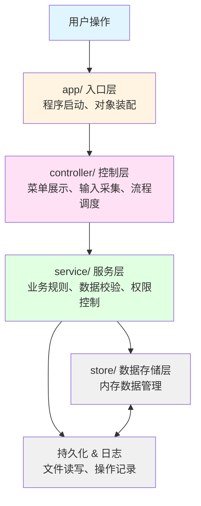

### 分层职责图

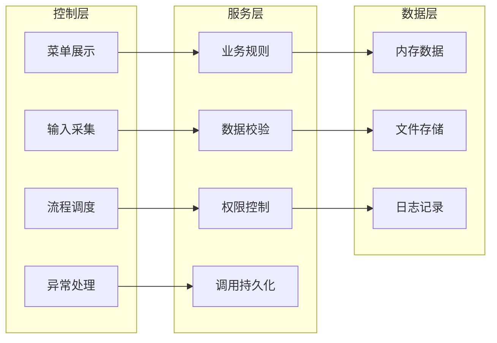

### 设计思想

> "系统按照分层架构组织，每层有明确的职责边界："
>
> "- **入口层**：管启动，不管业务"
> "- **控制层**：管流程，不管规则"
> "- **服务层**：管规则，不管存储"
> "- **存储层**：管数据，不管业务"
>
> "这样分层的好处是：改动一层不影响其他层，代码好维护、好扩展。比如以后想把文件存储换成数据库，只需要改持久化层，其他层都不用动。"

---

## 第三步：按层次讲解设计思想

### 1. app/ 入口层

**文件**：`Application.java`

**职责**：
- 程序启动入口
- 创建各个层的对象
- 完成依赖注入（把需要的服务传给控制器）
- 启动主流程

**设计思想**：

入口类不应该写业务逻辑，它只负责"把东西建好、连起来、启动起来"。这是一种"依赖注入"的思想。

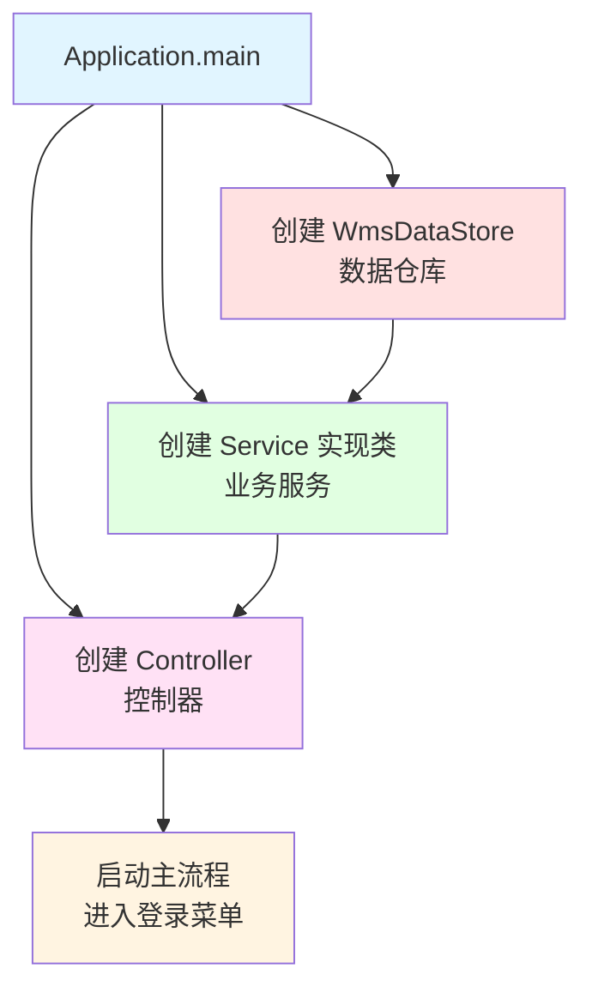

**为什么要这样设计**：

如果不这样做，让控制器自己去 new 服务对象，会导致：
- 控制器和具体实现类强耦合
- 想换实现方式时，必须改控制器代码
- 代码难以测试和维护

通过依赖注入：
- 控制器只知道接口，不知道具体实现
- 换实现只需要改入口类的一行代码
- 各层之间解耦，更灵活

**讲解要点**：

> "看入口类，它做的事很简单：创建数据仓库、创建服务、创建控制器，然后把服务注入给控制器，最后启动。"
>
> "为什么不在控制器里直接 new 服务？因为那样控制器就和具体实现绑死了。现在控制器只依赖接口，将来想换实现方式，入口类改一行就行。"

---

### 2. controller/ 控制层

**文件**：
- `LoginController` - 登录流程
- `MainController` - 主菜单调度
- `ProductController` - 商品管理菜单
- `StockController` - 库存操作菜单
- `UserController` - 用户管理菜单

**职责**：
- 展示菜单
- 采集用户输入
- 调用服务层完成业务
- 展示结果或错误信息
- 控制流程跳转

**设计思想**：

控制器只负责"流程怎么走"，不负责"规则怎么定"。具体业务逻辑都委托给服务层。

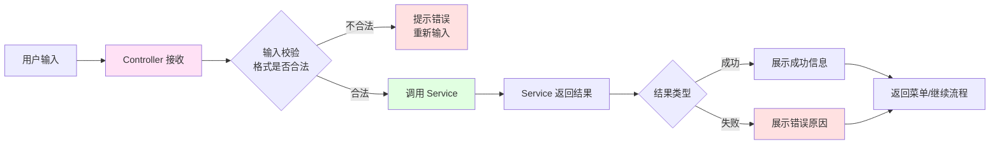

**为什么分多个控制器**：

如果所有菜单都放在一个控制器里：
- 单个类过于庞大
- 不同业务逻辑混在一起
- 难以维护和扩展

分控制器的好处：
- 每个控制器专注一块业务
- 职责清晰，易于理解
- 修改某块业务不影响其他部分

**讲解要点**：

> "为什么要有这么多控制器？因为不同业务有不同的菜单和流程。"
>
> "控制器只做三件事：收输入、调服务、展示结果。它不判断库存够不够，那是服务层的事。控制器就像前台接待，把客户需求转给后台处理。"

---

### 3. service/ 服务层

**接口定义**：
- `AuthService` - 认证服务
- `ProductService` - 商品服务
- `InventoryService` - 库存服务
- `UserService` - 用户服务
- `LogService` - 日志服务
- `PersistenceService` - 持久化服务

**实现类**：
- `AuthServiceImpl` - 登录校验、权限判断
- `ProductServiceImpl` - 商品增删改查
- `InventoryServiceImpl` - 入库出库核心逻辑
- `UserServiceImpl` - 用户管理
- `FileLogServiceImpl` - 日志写入
- `FilePersistenceServiceImpl` - 文件读写

**职责**：
- 定义业务规则
- 执行数据校验
- 进行权限判断
- 调用持久化层保存数据

**设计思想**：

先定义接口，再写实现。接口定义"要做什么"，实现类定义"怎么做"。

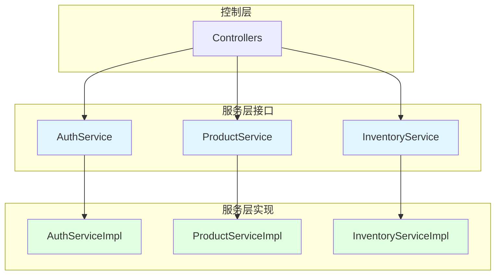

**为什么要接口和实现分离**：

如果只有实现类没有接口：
- 控制器直接依赖具体实现
- 换实现方式需要改控制器代码
- 难以进行单元测试（无法 mock）

接口和实现分离的好处：
- 控制器只依赖接口，不依赖具体实现
- 换实现方式只需要新增一个实现类
- 可以方便地进行单元测试

**核心服务说明**：

1. **InventoryService**（最重要）
   - 入库：增加库存、生成入库记录
   - 出库：减少库存、生成出库记录
   - 核心业务规则都在这里

2. **PersistenceService**
   - 启动时加载数据文件
   - 关键操作后保存数据
   - 数据恢复的保证

3. **AuthService**
   - 登录校验
   - 权限判断（能不能做某操作）

**讲解要点**：

> "服务层分为接口和实现两部分。"
>
> "接口定义能力：比如'需要有入库方法'、'需要有查询方法'。"
>
> "实现类定义具体怎么做：比如怎么校验、怎么修改数据、怎么写文件。"
>
> "这样做的好处：未来如果想把文件存储换成数据库，只需要新增一个 DatabasePersistenceServiceImpl，控制器和服务接口都不用改。这就是面向接口编程的价值。"

---

### 4. entity/ 实体层

**文件**：
- `User` - 用户信息
- `Product` - 商品信息
- `StockRecord` - 库存变动记录
- `OperationLog` - 操作日志

**职责**：
- 定义业务数据模型
- 封装业务对象的属性和行为
- 提供类型安全的数据访问

**设计思想**：

实体类对应的是业务对象，不是数据库表。每个字段都有明确的业务含义。

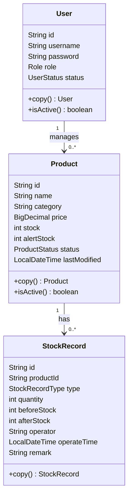

**为什么用实体类不用 Map**：

如果用 Map 存储业务数据：
```java
Map<String, Object> user = new HashMap<>();
user.put("username", "admin");
user.put("role", "ADMIN");
// 访问时没有类型检查
String role = (String) user.get("role"); // 容易出错
```

用实体类的好处：
```java
User user = new User();
user.setUsername("admin");
user.setRole(Role.ADMIN);
// 编译器会检查类型
Role role = user.getRole(); // 类型安全
```

**讲解要点**：

> "实体类对应的是业务对象，不是数据库表。"
>
> "比如 Product 有什么字段？看业务需求：编号、名称、分类、价格、库存、预警线、状态、最后修改时间。"
>
> "为什么不用 Map？因为 Map 没有类型约束，容易写错字段名，取值时要强制类型转换。实体类有编译器检查，更安全，IDE 也有提示。"

---

### 5. enums/ 枚举层

**文件**：
- `Role` - 角色（ADMIN、OPERATOR）
- `UserStatus` - 用户状态（ACTIVE、DISABLED）
- `ProductStatus` - 商品状态（ACTIVE、DISABLED）
- `StockRecordType` - 记录类型（IN、OUT）
- `LogLevel` - 日志级别（INFO、WARNING、ERROR）

**职责**：
- 定义业务中的固定选项
- 限定可选值范围
- 提供类型安全的常量

**设计思想**：

把可选值限定在明确范围内，比用字符串常量更安全。

**字符串 vs 枚举对比**：

```java
// 用字符串（容易出错）
if ("ADMIN".equals(user.getRole())) {  // 可能写成 "ADIMN"
    // ...
}

// 用枚举（编译器检查）
if (Role.ADMIN.equals(user.getRole())) {  // 拼写错误编译器会报错
    // ...
}
```

**讲解要点**：

> "为什么用枚举不用字符串？"
>
> "字符串容易写错，写成 'ADIMN' 编译器也不会报错，要到运行时才发现问题。"
>
> "枚举写错了，编译器直接告诉你，IDE 还有自动提示。而且枚举可以有方法和属性，比字符串更强大。"

---

### 6. permission/ 权限策略层

**文件**：
- `PermissionPolicy`（接口）- 权限策略接口
- `AdminPermissionPolicy` - 管理员权限实现
- `OperatorPermissionPolicy` - 操作员权限实现

**职责**：
- 封装不同角色的权限规则
- 判断某个角色能不能做某操作

**设计思想**：

用策略模式而不是 if-else 判断角色。不同角色有不同权限实现类。

**策略模式结构**：

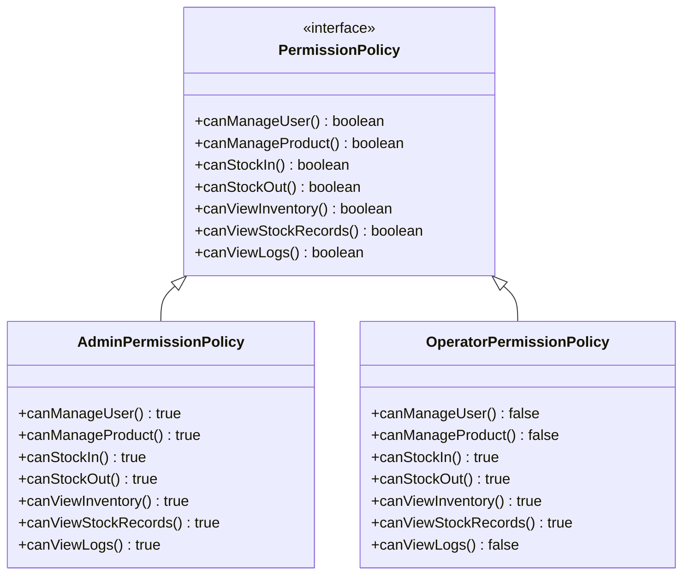

**传统 if-else 方式的问题**：

```java
// 到处都是角色判断
public void manageProducts() {
    if (user.getRole() == Role.ADMIN) {
        // 允许
    } else {
        // 拒绝
    }
}

public void manageUsers() {
    if (user.getRole() == Role.ADMIN) {
        // 允许
    } else {
        // 拒绝
    }
}
// 每个方法都要判断，代码重复，难以维护
```

**策略模式的方式**：

```java
// 每个用户有一个权限策略对象
PermissionPolicy policy = user.getPermissionPolicy();

// 判断时直接调用
if (policy.canManageProducts()) {
    // 允许
}

// 要加新角色，新增实现类就行
public class SuperAdminPermissionPolicy implements PermissionPolicy {
    public boolean canManageProducts() { return true; }
    public boolean canManageUsers() { return true; }
    public boolean canViewLogs() { return true; }
}
```

**权限获取流程**：

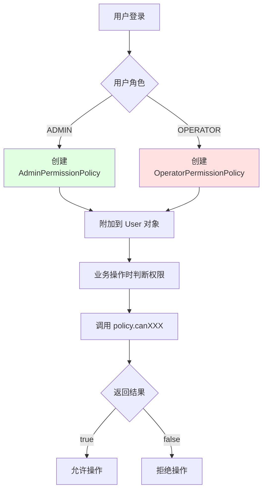

**讲解要点**：

> "不同角色的权限不一样，如果用 if-else 到处判断，代码会很难维护。"
>
> "这里用策略模式：定义一个权限策略接口，不同角色有不同实现。判断权限时直接调用策略对象的方法。"
>
> "要加新角色？新增一个实现类，不用改已有代码。这就是开闭原则的实际应用：对扩展开放，对修改关闭。"

---

### 7. store/ 数据存储层

**文件**：`WmsDataStore`

**职责**：
- 集中管理运行期所有内存数据
- 提供统一的数据访问接口
- 支持快照回滚机制

**设计思想**：

所有共享数据都放在这一个类里。服务层不直接持有数据，而是通过 DataStore 访问。便于统一管理和实现快照回滚。

**数据结构设计**：

```java
// 用户数据：用户名 → 用户对象
Map<String, User> usersByUsername;

// 商品数据：商品编号 → 商品对象
Map<String, Product> productsById;

// 库存记录：保持时间顺序
List<StockRecord> stockRecords;

// 商品对应记录：商品编号 → 该商品的记录列表
Map<String, List<StockRecord>> stockRecordsByProductId;
```

**为什么这样选择集合类型**：

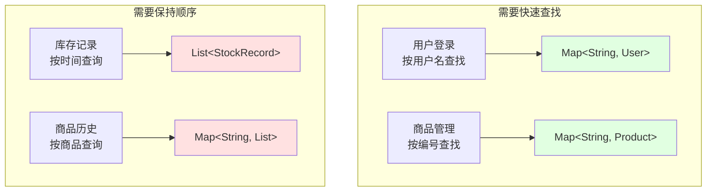

**访问模式对比**：

| 操作 | 用 Map | 用 List |
|------|--------|---------|
| 按编号查找商品 | O(1) 直接定位 | O(n) 遍历查找 |
| 按用户名登录 | O(1) 直接定位 | O(n) 遍历查找 |
| 查询所有记录 | - | O(1) 顺序访问 |
| 保持时间顺序 | 需额外排序 | 天然有序 |

**快照回滚机制**：

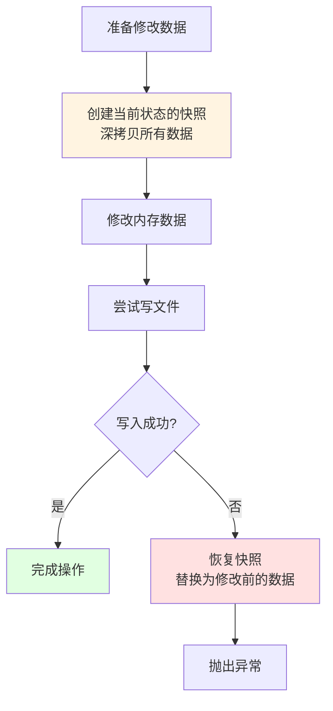

**讲解要点**：

> "为什么用户和商品用 Map，记录用 List？"
>
> "- 用户登录需要按用户名查找，用 Map 是 O(1)，用 List 要 O(n) 遍历"
> "- 商品管理需要按编号查找，同样用 Map 更快"
> "- 库存记录天然有顺序，要按时间查询，用 List 更合适"
>
> "不是所有数据都用同一个结构，要看你怎么用。需要快速查找的用 Map，需要保持顺序的用 List。"
>
> "关键操作前先拍快照，如果失败就恢复。这样保证内存和磁盘数据一致，不会出现'内存改了但文件没写成功'的问题。"

---

### 8. util/ 工具层

**文件**：
- `InputUtil` - 输入处理（读取、校验）
- `DateTimeUtil` - 时间格式化
- `FileUtil` - 文件操作
- `IdUtil` - ID 生成

**职责**：
- 提供跨层使用的通用能力
- 封装重复代码
- 统一处理逻辑

**设计思想**：

把重复使用的功能抽取成工具类。它们不属于任何业务层，各层都可以调用。

**工具类使用示例**：

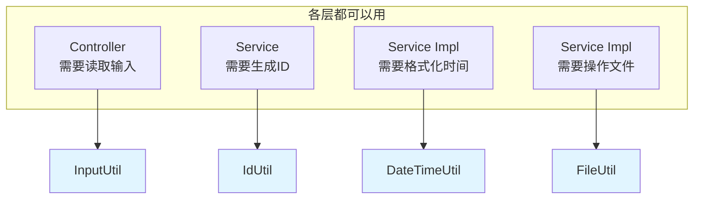

**讲解要点**：

> "工具类提供通用的能力：输入处理、时间格式化、文件操作、ID生成。"
>
> "它们不属于任何业务层，各层都可以用。这样可以避免重复代码，统一处理逻辑。"

---

## 第四步：核心业务流程

### 入库/出库完整流程

这是系统最重要的业务逻辑，展示了各层如何协同工作。

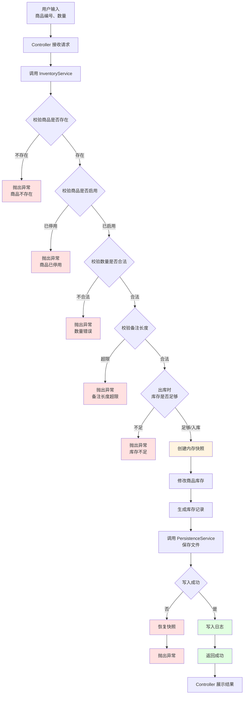

**流程要点**：

1. **多层校验**：商品存在性 → 商品状态 → 数量合法性 → 备注长度 → 库存充足性
2. **快照保护**：修改前先保存当前状态
3. **事务保证**：要么全成功，要么回滚到原点
4. **日志留痕**：成功后记录操作

**入库和出库的差异**：

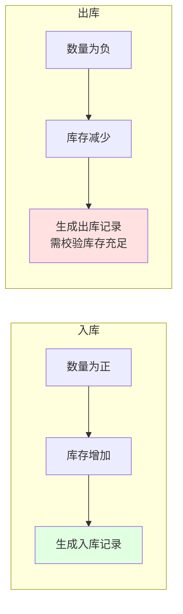

**讲解要点**：

> "入库出库共用一条流程，只是数量正负不同。这样代码复用性更好，也保证了两边的校验规则一致。"
>
> "关键操作前先拍快照，如果失败就回滚。这样保证数据一致性：要么全成功，要么回到原点，不会出现中间状态。"

---

## 第五步：数据持久化

### 持久化职责

**文件**：`FilePersistenceServiceImpl`

**职责**：
- 程序启动时加载数据文件
- 关键操作后保存数据
- 处理文件不存在的情况
- 容错处理（坏行跳过）

### 启动加载流程

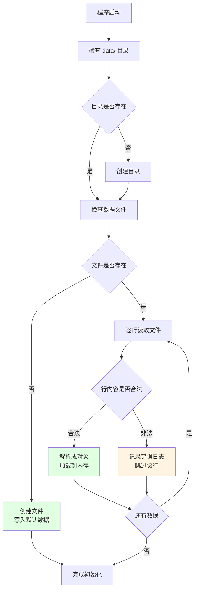

### 数据保存时机

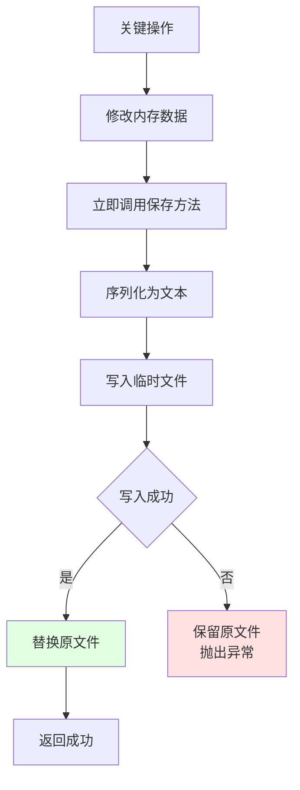

**为什么立即保存**：

- 保证数据不丢失（程序异常关闭也能恢复）
- 避免批量操作失败导致全部丢失
- 简化实现（不需要缓存机制）

**讲解要点**：

> "程序启动时自动检查文件，不存在就创建，存在就加载。"
>
> "读取时遇到坏行不会让程序崩溃，而是记录日志并跳过。这是工程化的容错设计。"
>
> "关键操作（入库出库）完成后立即写文件，保证程序关闭后数据不丢失。虽然频繁写文件有性能开销，但对于课程项目来说，简单可靠更重要。"

---

## 第六步：演示建议

### 推荐演示流程

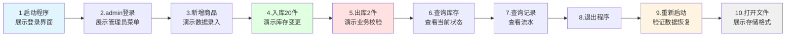

### 演示要点

- 围绕"新增 → 入库 → 出库 → 查询 → 重启恢复"这条主线
- 每一步说明在哪个层处理
- 重点展示数据不会丢失
- 可以打开文件展示数据格式

### 异常场景演示

可以演示一些异常情况，展示系统的健壮性：

- 输入不存在的商品编号
- 出库数量超过库存
- 输入负数数量
- 文件被损坏（手动改坏文件，看程序能否容错）
