# 项目讲解指南

讲解顺序：由表及里、由静态结构到动态流程。

```
先讲这是什么项目
    │
    ▼
再讲整体架构设计（纵览目录结构）
    │
    ▼
然后按层次讲每个包的职责和设计思想
    │
    ▼
最后讲核心业务流程和数据流转
    │
    ▼
演示 + 总结
```

---

## 核心特性

本项目是一个基于 JavaSE 的控制台版仓库进销存管理系统，展示了以下核心特性：

- **分层架构设计** — 控制层、服务层、数据层职责分离
- **接口驱动开发** — 面向接口编程，易于扩展和维护
- **策略模式应用** — 权限控制采用策略模式，支持多角色管理
- **快照回滚机制** — 关键操作支持事务性回滚，保证数据一致性
- **文件持久化** — 基于文本文件的数据存储，支持程序重启后数据恢复
- **完整日志系统** — 记录关键操作，支持问题追踪和审计

---

## 快速开始

### 环境要求

- JDK 17 或更高版本
- IDE（推荐 IntelliJ IDEA）
- UTF-8 编码

### 默认账号

| 角色 | 用户名 | 密码 |
|------|--------|------|
| 管理员 | `admin` | `123456` |
| 操作员 | `tom` | `123456` |

### 运行方式

在 IDE 中运行 `src/com/demo/wms/app/Application.java` 即可启动程序。

---

## 整体架构纵览

从目录结构进入系统分层，这是建立整体认知最直接的方式。

### 目录结构

```
src/com/demo/wms
├── app/                      【入口层】
│   └── Application.java
│
├── controller/               【控制层】
│   ├── LoginController.java
│   ├── MainController.java
│   ├── ProductController.java
│   ├── StockController.java
│   └── UserController.java
│
├── service/                  【服务层】
│   ├── AuthService.java      ────┐
│   ├── ProductService.java       │ 接口定义
│   ├── InventoryService.java     │
│   ├── UserService.java          │
│   ├── LogService.java           │
│   ├── PersistenceService.java   │
│   └── impl/                 ────┘
│       ├── AuthServiceImpl.java
│       ├── ProductServiceImpl.java
│       ├── InventoryServiceImpl.java
│       ├── UserServiceImpl.java
│       ├── FileLogServiceImpl.java
│       ├── FilePersistenceServiceImpl.java
│       └── ServiceSupport.java
│
├── entity/                   【实体层】
│   ├── User.java
│   ├── Product.java
│   ├── StockRecord.java
│   └── OperationLog.java
│
├── enums/                    【枚举层】
│   ├── Role.java
│   ├── UserStatus.java
│   ├── ProductStatus.java
│   ├── StockRecordType.java
│   └── LogLevel.java
│
├── permission/               【权限策略层】
│   ├── PermissionPolicy.java
│   ├── AdminPermissionPolicy.java
│   └── OperatorPermissionPolicy.java
│
├── store/                    【数据存储层】
│   └── WmsDataStore.java
│
└── util/                     【工具层】
    ├── InputUtil.java
    ├── DateTimeUtil.java
    ├── FileUtil.java
    └── IdUtil.java
```

### 分层职责图

这张图用于说明“系统由哪些层组成、各层分别依赖什么”。

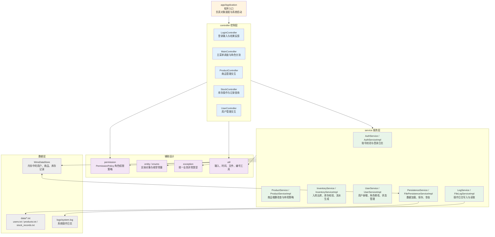

### 分层定义表

这张表用于补充说明“每一层具体负责什么、应当优先讲哪些文件”。

| 层级 | 主要职责 | 代表文件 | 核心知识点 |
|------|------|------|------|
| `app` 入口层 | 启动程序、创建对象、完成依赖装配 | `Application.java` | 程序入口、对象装配、启动流程 |
| `controller` 控制层 | 展示菜单、接收输入、调度业务流程、反馈结果 | `MainController.java`、`ProductController.java`、`StockController.java` | 流程控制、人机交互、结果输出 |
| `service` 服务层 | 编写业务规则、参数校验、调用存储与日志 | `InventoryServiceImpl.java`、`ProductServiceImpl.java`、`AuthServiceImpl.java` | 业务核心、规则校验、接口实现 |
| `permission` 权限策略层 | 按角色定义可执行能力，隔离权限判断逻辑 | `PermissionPolicy.java`、`AdminPermissionPolicy.java`、`OperatorPermissionPolicy.java` | 策略模式、多态、角色权限 |
| `entity` 实体层 | 抽象业务对象，承载系统核心数据 | `User.java`、`Product.java`、`StockRecord.java` | 实体建模、对象属性、业务对象 |
| `enums` 枚举层 | 约束固定选项，统一角色、状态、类型等常量 | `Role.java`、`UserStatus.java`、`StockRecordType.java` | 固定取值、语义清晰、减少硬编码 |
| `exception` 异常层 | 统一表达业务错误、权限错误、解析错误等异常情况 | `BizException.java`、`LoginException.java`、`DataParseException.java` | 异常分类、统一处理、错误表达 |
| `store` 数据存储层 | 管理运行期内存数据，维护商品、用户和库存记录 | `WmsDataStore.java` | 内存仓库、集合管理、快照回滚 |
| `util` 工具层 | 提供输入、时间、文件、编号等通用能力 | `InputUtil.java`、`DateTimeUtil.java`、`FileUtil.java`、`IdUtil.java` | 工具复用、公共能力、减少重复代码 |
| `data/logs` 文件层 | 保存业务数据与系统日志，实现重启恢复和留痕 | `data/users.txt`、`data/products.txt`、`logs/system.log` | 持久化、日志记录、数据恢复 |

### 数据流转架构

这张图用于说明“系统运行时，用户操作如何沿着各层向下传递并完成落盘”。

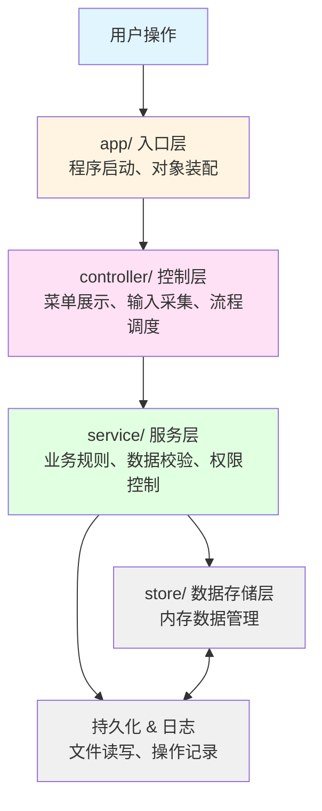

### 设计思想

> "系统按照分层架构组织，每层都有明确的职责边界："
>
> "- **入口层**：管启动，不管业务"
> "- **控制层**：管流程，不管规则"
> "- **服务层**：管规则，不管存储"
> "- **存储层**：管数据，不管业务"
>
> "这种分层方式的价值在于：改动一层通常不会连带影响其他层，系统更易维护，也更容易扩展。例如未来若希望把文本文件存储替换为数据库，只需调整持久化层即可。"

### 设计模式应用

本项目应用了多种经典设计模式，在讲解时可以重点强调：

| 设计模式 | 应用位置 | 作用 |
|----------|----------|------|
| **依赖注入** | `Application.java` | 在入口类统一创建和装配对象，控制器通过构造函数接收依赖，避免层间耦合 |
| **策略模式** | `permission/` 包 | 不同角色对应不同的权限策略实现，业务代码通过接口调用，符合开闭原则 |
| **接口驱动** | `service/` 包 | 服务层定义接口和实现分离，控制器依赖接口而非具体实现，便于扩展和测试 |
| **防御性拷贝** | `entity/` 包 | 实体类提供 `copy()` 方法，返回副本而非原对象，防止外部误改内部数据 |
| **快照模式** | `store/` 包 | 数据仓库提供快照和替换方法，关键操作前创建快照，失败时回滚，保证数据一致性 |

---

## 按层次讲解设计思想

### 1. app/ 入口层

**文件**：`Application.java`

**职责**：
- 程序启动入口
- 创建各个层的对象
- 完成依赖注入（把需要的服务传给控制器）
- 启动主流程

**设计说明**：

入口类不包含业务逻辑。

它只负责“把对象创建好、把依赖连接好、把系统启动起来”，这正是依赖注入思想在本项目中的体现。

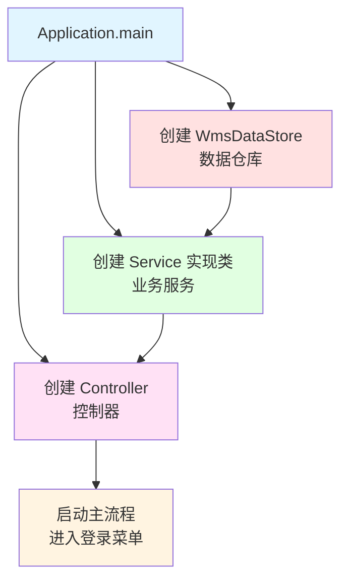

**为什么要这样设计**：

如果让控制器自己去 new 服务对象，会导致：
- 控制器和具体实现类强耦合
- 想换实现方式时，必须改控制器代码
- 代码难以测试和维护

通过依赖注入：
- 控制器只知道接口，不知道具体实现
- 换实现只需要改入口类的一行代码
- 各层之间解耦，更灵活

**代码解读**：

打开 `Application.java` 看一下，整个 `main()` 方法只有 30 多行代码，我们来逐行拆解它是怎么把整个系统”组装”起来的。

```java
// 第 32-34 行：先把基础设施准备好
WmsDataStore dataStore = new WmsDataStore();
LogService logService = new FileLogServiceImpl();
PersistenceService persistenceService = new FilePersistenceServiceImpl(dataStore, logService);
```

这三行代码在干什么？就像盖房子先打地基一样：
- `WmsDataStore` 是一个”内存仓库”，所有用户、商品、库存记录都存在这里
- `LogService` 负责”写日记”，谁做了什么操作都记下来
- `PersistenceService` 负责”存硬盘”，内存里的数据要写到文件里才不会丢

注意看 `PersistenceService` 的构造函数，它需要 `dataStore` 和 `logService` —— 这就是”依赖注入”的体现：持久化服务要操作数据仓库，操作失败了要写日志，所以它俩得传进去。

```java
// 第 37-38 行：启动时先恢复数据
persistenceService.initialize();
persistenceService.loadAll();
```

这两行很关键，说明程序启动不是直接开始干活，而是先”回忆过去”：
- `initialize()` 检查 data 目录存在吗？不存在就创建
- `loadAll()` 把上次保存的用户、商品、记录都读到内存里

```java
// 第 40-43 行：创建各个业务服务
AuthService authService = new AuthServiceImpl(dataStore, logService);
ProductService productService = new ProductServiceImpl(dataStore, persistenceService);
InventoryService inventoryService = new InventoryServiceImpl(dataStore, persistenceService, logService);
UserService userService = new UserServiceImpl(dataStore, persistenceService);
```

每个 Service 都有自己需要的依赖：
- `AuthService` 需要查用户（`dataStore`），需要记录登录日志（`logService`）
- `ProductService` 需要操作商品（`dataStore`），需要保存数据（`persistenceService`）
- `InventoryService` 三个都要，因为库存操作最复杂

```java
// 第 45 行：创建输入扫描器
Scanner scanner = new Scanner(System.in);
```

这一行很重要，说明整个系统共用一个 `Scanner`，不是每个控制器都自己创建一个。

```java
// 第 47-50 行：创建各个控制器
LoginController loginController = new LoginController(scanner, authService);
ProductController productController = new ProductController(scanner, productService, logService);
StockController stockController = new StockController(scanner, productService, inventoryService, logService);
UserController userController = new UserController(scanner, userService, logService);
```

控制器就像”前台”，用户输入的东西先到这里，然后它再去找对应的 Service 处理。注意每个控制器需要什么：
- 登录控制器只需要扫描器和认证服务
- 库存控制器需要商品服务（查商品）、库存服务（改库存）、日志服务（记操作）

```java
// 第 52-60 行：创建总控制器
MainController mainController = new MainController(
    scanner, loginController, productController,
    stockController, userController, logService, persistenceService
);
```

`MainController` 是”总指挥”，它把其他控制器都管起来，决定什么时候该用哪个。

```java
// 第 63 行：真正启动系统
mainController.start();
scanner.close();
```

前面都是在”搭台子”，只有这一行是”唱戏”。程序从这一行开始真正和用户交互。

**总结一下入口类的三层逻辑**：

1. **打地基**（32-34 行）：创建数据仓库、日志服务、持久化服务
2. **回忆过去**（37-38 行）：加载历史数据，恢复到上次关闭时的状态
3. **搭台子**（40-60 行）：创建所有服务和控制器，把依赖关系串好
4. **开演**（63 行）：调用总控制器的 `start()` 方法，进入业务主循环

**为什么不让控制器自己 `new` Service？**

如果 `ProductController` 自己写 `new ProductServiceImpl()`，问题就来了：
- 控制器就和具体实现类绑死了，想换实现方式就得改控制器代码
- 测试的时候没法用假的 Service 替换
- 不同的控制器可能各自创建一份 Service，资源浪费

通过入口类统一创建和注入，控制器只拿到”接口”，不关心”具体实现”，这就是**依赖注入**的核心思想。

**核心要点**：

- 入口类负责完成 `WmsDataStore`、Service 和 Controller 的创建与装配。
- 启动顺序可以概括为：`创建对象 -> 注入依赖 -> 启动主流程`。
- 不在控制器里直接 `new` Service，是为了避免控制器与具体实现类强耦合。
- 当前控制器依赖的是接口，因此将来若要替换实现方式，通常只需调整入口层装配代码。

---

### 2. entity/ 实体层

**文件**：
- `User` - 用户信息
- `Product` - 商品信息
- `StockRecord` - 库存变动记录
- `OperationLog` - 操作日志

**职责**：
- 定义业务数据模型
- 封装业务对象的属性和行为
- 提供类型安全的数据访问

**设计思想**：

实体类对应的是业务对象，而不是数据库表。

每个字段都服务于明确的业务语义，因此适合先建立数据认知，再进入流程和规则讲解。

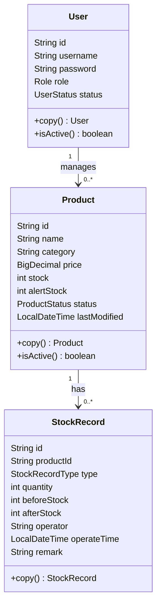

**为什么用实体类不用 Map**：

如果用 Map 存储业务数据：
```java
Map<String, Object> user = new HashMap<>();
user.put("username", "admin");
user.put("role", "ADMIN");
// 访问时没有类型检查
String role = (String) user.get("role"); // 容易出错
```

用实体类的好处：
```java
User user = new User();
user.setUsername("admin");
user.setRole(Role.ADMIN);
// 编译器会检查类型
Role role = user.getRole(); // 类型安全
```

**代码示例讲解**：

打开 `Product.java` 看一下，我们来一行一行拆这个实体类。

```java
// 第 31-38 行：字段定义
private String id;
private String name;
private String category;
private BigDecimal price;
private int stock;
private int alertStock;
private ProductStatus status;
private LocalDateTime lastModified;
```

先看前三个字段 —— `id`、`name`、`category`，这三个是”商品是谁”的基础信息：
- `id` 是商品编号，就像身份证号，用来唯一标识一个商品
- `name` 是商品名称，比如”iPhone 15”
- `category` 是商品分类，比如”电子产品”

再看 `price`，用的是 `BigDecimal` 而不是 `double` —— 这是个重要的细节：
- 金额计算不能用 `double`，因为它有精度问题（比如 0.1 + 0.2 可能等于 0.30000000000000004）
- `BigDecimal` 是专门用来做精确金额计算的类

接下来是 `stock` 和 `alertStock`，这两个是库存管理的核心字段：
- `stock` 是当前库存数量，比如仓库里现在有 100 台
- `alertStock` 是预警线，比如设置成 10，库存低于 10 就要提醒补货

然后是 `status`，它是 `ProductStatus` 枚举类型（不是字符串）：
- `ACTIVE` 表示商品启用，可以正常出入库
- `DISABLED` 表示商品停用，不能再操作

最后是 `lastModified`，记录的是”最后一次修改时间”：
- 每次库存变化都会更新这个时间
- 可以用来排序，比如”最近修改的商品排在前面”

---

**现在来看两个很有意思的方法**：

```java
// 第 60-62 行：拷贝方法
public Product copy() {
    return new Product(this);
}
```

这个 `copy()` 方法在干什么？它返回一个”新的 Product 对象”，内容和原来一样，但是是独立的副本。

为什么需要这个？看个场景：
```java
// 假设仓库里有个商品
Product p1 = dataStore.getProductsById().get(“P001”);

// 如果直接返回 p1，外部代码可能会：
p1.setStock(999);  // 直接把仓库里的库存改了！

// 但如果返回副本：
Product p2 = p1.copy();
p2.setStock(999);  // 只改了副本，仓库里的 p1 没变
```

这就是”防御性拷贝”的思想 —— 不让外部直接操作仓库里的原始对象。

---

```java
// 第 64-66 行：状态判断方法
public boolean isActive() {
    return status == ProductStatus.ACTIVE;
}
```

这个方法很简单，但它体现了一个设计思想：**把判断逻辑封装到对象内部**。

对比一下两种写法：
```java
// 写法一：外部判断
if (product.getStatus() == ProductStatus.ACTIVE) {
    // 允许操作
}

// 写法二：用封装的方法
if (product.isActive()) {
    // 允许操作
}
```

第二种写法读起来更像”人话”：如果商品是激活的，就... 而不是”如果商品的状态等于 ACTIVE 枚举值”。

---

**总结一下 `Product` 这个实体类**：

它不只是”8 个字段的容器”，而是承载了几个设计思想：

1. **类型安全**：金额用 `BigDecimal`，状态用枚举，不用原始类型
2. **防御性拷贝**：提供 `copy()` 方法，防止外部误改内部数据
3. **语义封装**：提供 `isActive()` 方法，让代码读起来更自然

这个类正好说明：实体类不是简单的 POJO（Plain Old Java Object），它也可以有自己的行为，来表达”这个对象能做什么、处于什么状态”。

**核心要点**：

- 实体类对应的是业务对象，而不是数据库表。
- 例如 `Product` 会围绕业务需求定义字段：`编号`、`名称`、`分类`、`价格`、`库存`、`预警线`、`状态`、`最后修改时间`。
- 不直接使用 `Map` 存业务数据，是因为 `Map` 缺少类型约束，字段名容易写错，取值时还需要强制类型转换。
- 使用实体类后，编译器和 IDE 都能提供类型检查与代码提示，可读性和安全性更好。

---

### 3. enums/ 枚举层

**文件**：
- `Role` - 角色（ADMIN、OPERATOR）
- `UserStatus` - 用户状态（ACTIVE、DISABLED）
- `ProductStatus` - 商品状态（ACTIVE、DISABLED）
- `StockRecordType` - 记录类型（IN、OUT）
- `LogLevel` - 日志级别（INFO、WARNING、ERROR）

**职责**：
- 定义业务中的固定选项
- 限定可选值范围
- 提供类型安全的常量

**设计思想**：

枚举的作用是把可选值限定在明确范围内。

相比直接使用字符串常量，这种方式更安全，也更利于阅读和维护。

**字符串 vs 枚举对比**：

```java
// 用字符串（容易出错）
if ("ADMIN".equals(user.getRole())) {  // 可能写成 "ADIMN"
    // ...
}

// 用枚举（编译器检查）
if (Role.ADMIN.equals(user.getRole())) {  // 拼写错误编译器会报错
    // ...
}
```

**代码示例讲解**：

打开 `Role.java`，我们来看这个枚举类是怎么把”角色”这个概念表达清楚的。

```java
// 第 17-19 行：枚举常量定义
ADMIN(“管理员”),
OPERATOR(“操作员”);
```

这两行代码说明系统里只有两个角色：管理员和操作员。注意这里的写法：
- `ADMIN` 是枚举常量的”名字”，程序代码里用它来判断和比较
- `”管理员”` 是构造函数的参数，赋值给 `displayName` 字段

**为什么不用字符串？**

对比一下：
```java
// 方式一：用字符串（容易出错）
String role = “ADMIN”;
if (“ADIMN”.equals(role)) {  // 拼写错误，但编译器不会报错
    // ...
}

// 方式二：用枚举（编译器检查）
Role role = Role.ADMIN;
if (Role.ADMN.equals(role)) {  // 拼写错误，编译器直接报错！
    // ...
}
```

用枚举的好处：拼写错误在编译阶段就能发现，而且 IDE 会自动提示。

---

```java
// 第 21-25 行：枚举字段和构造方法
private final String displayName;

Role(String displayName) {
    this.displayName = displayName;
}
```

这里说明每个枚举常量都有一个 `displayName` 字段，用来存中文名称。

为什么要这样设计？因为：
- `ADMIN`、`OPERATOR` 是给**程序**用的，写代码时方便判断
- `”管理员”`、`”操作员”` 是给**用户**看的，显示在控制台上更友好

一个枚举常量同时解决了”程序怎么判断”和”界面怎么显示”两个问题。

---

```java
// 第 27-29 行：获取显示名称
public String getDisplayName() {
    return displayName;
}
```

这个方法很简单，就是让外部代码能拿到中文名称。比如登录成功后显示：
```java
System.out.println(“欢迎你，” + user.getRole().getDisplayName());
// 输出：欢迎你，管理员
```

---

```java
// 第 31-38 行：字符串转换方法
public static Role fromString(String text) {
    for (Role role : values()) {
        if (role.name().equalsIgnoreCase(text)) {
            return role;
        }
    }
    throw new IllegalArgumentException(“未知角色：” + text);
}
```

这个方法是干什么用的？它的作用是把**字符串转成枚举值**。

场景是这样的：
1. 文件里保存的是字符串 `”ADMIN”`（不是枚举对象）
2. 程序启动时读取文件，拿到字符串
3. 调用 `Role.fromString(“ADMIN”)` 得到 `Role.ADMIN` 枚举对象
4. 后续业务逻辑用枚举对象来判断

`role.name().equalsIgnoreCase(text)` 这行代码的意思是：
- `role.name()` 返回枚举常量的名字（比如 `”ADMIN”`）
- `equalsIgnoreCase(text)` 忽略大小写比较（所以 `”admin”` 也能匹配）

---

**总结一下 `Role` 这个枚举类**：

1. **限定取值范围**：系统里只有 `ADMIN` 和 `OPERATOR` 两个角色，编译期就确定了
2. **分离程序值和显示值**：`ADMIN` 用于判断逻辑，`”管理员”` 用于界面显示
3. **支持双向转换**：枚举可以转字符串（`name()`），字符串可以转枚举（`fromString()`）

这个类正好说明：**枚举不只是”常量列表”，它可以是”带字段、带方法的特殊类”**。

**核心要点**：

- 使用枚举而不是字符串，核心原因是类型更安全。
- 如果把 `ADMIN` 写成 `"ADIMN"`，字符串方式通常只能在运行时发现问题。
- 枚举写错时，编译阶段往往就能发现，IDE 也会提供自动补全。
- 此外，枚举还可以定义属性和方法，因此表达能力比普通字符串更强。

---

### 4. controller/ 控制层

**文件**：
- `LoginController` - 登录流程
- `MainController` - 主菜单调度
- `ProductController` - 商品管理菜单
- `StockController` - 库存操作菜单
- `UserController` - 用户管理菜单

**职责**：
- 展示菜单
- 采集用户输入
- 调用服务层完成业务
- 展示结果或错误信息
- 控制流程跳转

**设计思想**：

控制器只负责“流程怎么走”，不负责“规则怎么定”。

具体业务逻辑统一委托给服务层处理。

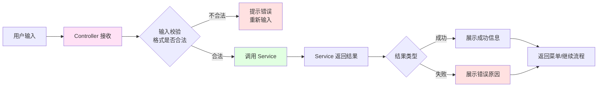

**为什么分多个控制器**：

如果所有菜单都放在一个控制器里：
- 单个类过于庞大
- 不同业务逻辑混在一起
- 难以维护和扩展

分控制器的好处：
- 每个控制器专注一块业务
- 职责清晰，易于理解
- 修改某块业务不影响其他部分

**代码示例讲解**：

打开 `MainController.java`，这个文件是整个系统的”总指挥”。我们来看它是怎么调度各个模块的。

```java
// 第 20-27 行：成员变量定义
private final Scanner scanner;
private final LoginController loginController;
private final ProductController productController;
private final StockController stockController;
private final UserController userController;
private final LogService logService;
private final PersistenceService persistenceService;
```

注意这里所有的成员变量都是 `final` 的，说明它们在构造时就被注入进来，之后不会再变 —— 这就是”依赖注入”在控制器层的体现。

`MainController` 需要这些依赖：
- `scanner`：读取用户输入
- 四个业务控制器：处理具体业务模块
- `logService` 和 `persistenceService`：记录日志和保存数据

---

```java
// 第 45-63 行：start() 方法 —— 登录前菜单
public void start() {
    while (true) {
        printLoginMenu();
        int choice = InputUtil.readMenuChoice(scanner, “请选择：”, 0, 1);
        switch (choice) {
            case 1:
                handleLogin();
                break;
            case 0:
                safeSaveBeforeExit();
                logService.info(“SYSTEM”, “APP”, “EXIT”, “系统安全退出”);
                System.out.println(“系统已退出，欢迎下次使用。”);
                return;
            default:
                break;
        }
    }
}
```

这个 `while(true)` 循环就是”主循环”，程序一直在这里转：
1. 显示登录前菜单
2. 等用户选 1（登录）或 0（退出）
3. 选 1 就调用 `handleLogin()`
4. 选 0 就保存数据、写日志、退出程序

注意 `case 0` 里有个 `safeSaveBeforeExit()` 调用 —— 这是防止用户刚改完数据就直接退出，导致修改没保存。

---

```java
// 第 65-74 行：handleLogin() 方法
private void handleLogin() {
    try {
        User currentUser = loginController.login();
        System.out.println(“登录成功，欢迎你，” + currentUser.getUsername() + “（” + currentUser.getRole().getDisplayName() + “）”);
        handleMainMenu(currentUser);
    } catch (BizException ex) {
        System.out.println(“登录失败：” + ex.getMessage());
    }
}
```

这个方法的逻辑很清晰：
1. 调用 `loginController.login()` 做登录校验
2. 成功就拿到 `currentUser` 对象，然后进入主菜单
3. 失败就显示错误信息，回到登录前菜单

**注意**：这里没有做任何密码校验、用户查询的工作，全部委托给 `LoginController` —— 这就是”控制层不管业务规则”的体现。

---

```java
// 第 76-95 行：handleMainMenu() 方法 —— 登录后主菜单
private void handleMainMenu(User currentUser) {
    while (true) {
        PermissionPolicy permissionPolicy = resolvePermission(currentUser);
        if (currentUser.getRole() == Role.ADMIN) {
            printAdminMenu();
            int choice = InputUtil.readMenuChoice(scanner, “请选择：”, 0, 5);
            if (processAdminChoice(choice, currentUser, permissionPolicy)) {
                return;
            }
        } else {
            printOperatorMenu();
            int choice = InputUtil.readMenuChoice(scanner, “请选择：”, 0, 2);
            if (processOperatorChoice(choice, currentUser, permissionPolicy)) {
                return;
            }
        }
    }
}
```

这段代码体现了两层分流：

**第一层：界面分流**
```java
if (currentUser.getRole() == Role.ADMIN) {
    printAdminMenu();      // 显示管理员菜单（5 个选项）
} else {
    printOperatorMenu();   // 显示操作员菜单（2 个选项）
}
```
管理员看到的菜单和操作员不一样，这是”界面层面”的区分。

**第二层：权限能力**
```java
PermissionPolicy permissionPolicy = resolvePermission(currentUser);
```
不管管理员还是操作员，都对应一个 `PermissionPolicy` 对象，用来判断”能做什么”。

---

```java
// 第 165-171 行：resolvePermission() 方法
private PermissionPolicy resolvePermission(User currentUser) {
    if (currentUser.getRole() == Role.ADMIN) {
        return new AdminPermissionPolicy();
    }
    return new OperatorPermissionPolicy();
}
```

这个方法就是”角色 -> 权限策略”的映射：
- 管理员 -> `AdminPermissionPolicy`（全权限）
- 操作员 -> `OperatorPermissionPolicy`（受限权限）

后续业务代码不需要再判断角色，直接调用 `permissionPolicy.canXXX()` 就行。

---

```java
// 第 97-121 行：processAdminChoice() 方法
private boolean processAdminChoice(int choice, User currentUser, PermissionPolicy permissionPolicy) {
    switch (choice) {
        case 1:
            productController.manageProducts(currentUser, permissionPolicy);
            return false;
        case 2:
            stockController.manageInventory(currentUser, permissionPolicy);
            return false;
        // ... 其他 case
        case 0:
            logService.info(currentUser.getUsername(), “AUTH”, “LOGOUT”, “退出登录”);
            System.out.println(“已退出当前账号。”);
            return true;
        default:
            return false;
    }
}
```

注意这里返回 `boolean` 的含义：
- `false` 表示”继续留在主菜单”
- `true` 表示”退出登录，返回登录前菜单”

每个 case 都把请求分发给对应的业务控制器，比如选 1 就调用 `productController.manageProducts()`。

**重点**：这里没有做任何权限检查，直接把 `permissionPolicy` 传给下层 —— 因为权限检查应该在各个业务控制器内部做，而不是在这里判断。

---

**总结一下 `MainController` 的职责**：

1. **菜单展示**：根据角色显示不同的菜单
2. **流程调度**：根据用户选择调用对应的控制器
3. **权限对象创建**：把角色转换成权限策略对象
4. **退出保存**：确保程序退出前数据不会丢失

**它不做的事情**（这些是服务层的工作）：
- 不校验库存是否充足
- 不检查商品是否存在
- 不计算金额
- 不写文件

用一句话概括：`MainController` 是”前台接待”，负责把用户引导到对应的”业务窗口”，但具体业务怎么处理，它不管。

**核心要点**：

- 设置多个控制器，是因为不同业务模块有各自独立的菜单和流程。
- 控制层的职责可以概括为：`收输入 -> 调服务 -> 展示结果`。
- 控制器不负责判断库存是否充足，也不负责定义业务规则，这些工作应交给服务层。
- 可以将控制层理解为前台入口，负责接收请求并把请求转交给后台业务处理。

---

### 5. permission/ 权限策略层

**文件**：
- `PermissionPolicy`（接口）- 权限策略接口
- `AdminPermissionPolicy` - 管理员权限实现
- `OperatorPermissionPolicy` - 操作员权限实现

**职责**：
- 封装不同角色的权限规则
- 判断某个角色能不能做某操作

**设计思想**：

权限控制采用策略模式，而不是在各处直接使用 `if-else` 判断角色。

不同角色分别对应不同的权限实现类，因此权限变化能够被控制在单独的策略对象中。

**策略模式结构**：

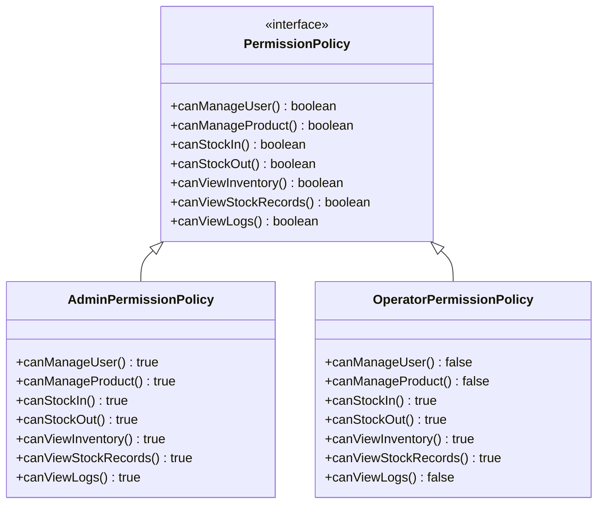

**权限对照表**：

| 权限方法 | 管理员 | 操作员 |
|------|------|------|
| `canManageUser()` | `true` | `false` |
| `canManageProduct()` | `true` | `false` |
| `canStockIn()` | `true` | `true` |
| `canStockOut()` | `true` | `true` |
| `canViewInventory()` | `true` | `true` |
| `canViewStockRecords()` | `true` | `true` |
| `canViewLogs()` | `true` | `false` |

可以将其概括为：管理员属于全权限角色，操作员保留库存相关权限，但不参与用户管理、商品主数据维护和日志查看。

**传统 if-else 方式的问题**：

```java
// 到处都是角色判断
public void manageProducts() {
    if (user.getRole() == Role.ADMIN) {
        // 允许
    } else {
        // 拒绝
    }
}

public void manageUsers() {
    if (user.getRole() == Role.ADMIN) {
        // 允许
    } else {
        // 拒绝
    }
}
// 每个方法都要判断，代码重复，难以维护
```

**策略模式的方式**：

```java
// 每个用户有一个权限策略对象
PermissionPolicy policy = user.getPermissionPolicy();

// 判断时直接调用
if (policy.canManageProducts()) {
    // 允许
}

// 要加新角色，新增实现类就行
public class SuperAdminPermissionPolicy implements PermissionPolicy {
    public boolean canManageProducts() { return true; }
    public boolean canManageUsers() { return true; }
    public boolean canViewLogs() { return true; }
}
```

**权限获取流程**：

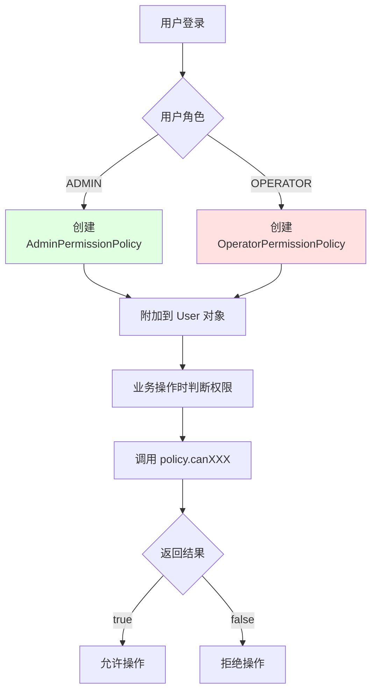

**代码示例讲解**：

先看 `PermissionPolicy.java`，这是权限策略的**接口定义**：

```java
// 第 10-58 行：接口方法定义
public interface PermissionPolicy {
    boolean canManageUser();        // 能不能管理用户
    boolean canManageProduct();     // 能不能管理商品
    boolean canStockIn();           // 能不能入库
    boolean canStockOut();          // 能不能出库
    boolean canViewInventory();     // 能不能查看库存
    boolean canViewStockRecords();  // 能不能查看记录
    boolean canViewLogs();          // 能不能查看日志
}
```

这个接口定义了”角色能做什么”，但不关心”具体是哪个角色”。它的作用是：**把权限判断抽象成统一的能力列表**。

---

再看 `AdminPermissionPolicy.java`，管理员的权限实现：

```java
// 第 9-44 行：管理员全是 true
@Override
public boolean canManageUser() {
    return true;
}

@Override
public boolean canManageProduct() {
    return true;
}

@Override
public boolean canStockIn() {
    return true;
}
// ... 所有方法都返回 true
```

管理员是”全权限角色”，所有方法都返回 `true` —— 表示管理员什么都能做。

---

再看 `OperatorPermissionPolicy.java`，操作员的权限实现：

```java
// 第 11-44 行：操作员部分 true 部分 false
@Override
public boolean canManageUser() {
    return false;  // 不能管理用户
}

@Override
public boolean canManageProduct() {
    return false;  // 不能管理商品
}

@Override
public boolean canStockIn() {
    return true;   // 可入库
}

@Override
public boolean canStockOut() {
    return true;   // 可出库
}

@Override
public boolean canViewLogs() {
    return false;  // 不能看日志
}
```

操作员是”受限角色”：只能做库存相关的事，不能管理用户、商品，也不能看日志。

---

**这两种实现类的方法名完全一样，区别只在返回值** —— 这正是策略模式的核心思想：
- **接口不变**：`PermissionPolicy` 定义的方法是固定的
- **实现可变**：不同角色返回不同的 true/false 组合
- **调用方式不变**：业务代码统一调用 `policy.canXXX()`
- **行为结果随策略变化**：传入不同策略对象，得到不同结果

---

**对比一下传统写法**：

```java
// 传统写法：到处都是 if-else
if (user.getRole() == Role.ADMIN) {
    // 允许操作
} else {
    // 拒绝操作
}
```

这种写法的问题：
1. 每个需要判断权限的地方都要写一遍 `if-else`
2. 如果要加新角色，需要改所有这些地方
3. 代码重复，难以维护

```java
// 策略模式写法
PermissionPolicy policy = resolvePermission(user);
if (policy.canManageProduct()) {
    // 允许操作
}
```

这种写法的好处：
1. 不需要知道具体角色，只判断”有没有这个能力”
2. 加新角色只需新增一个实现类
3. 权限规则集中在一个地方，好改好维护

---

**权限对象是怎么创建和使用的？**

看 `MainController` 里的一段代码：

```java
// 第 78 行：根据角色创建策略对象
PermissionPolicy permissionPolicy = resolvePermission(currentUser);

// 第 165-171 行：创建逻辑
private PermissionPolicy resolvePermission(User currentUser) {
    if (currentUser.getRole() == Role.ADMIN) {
        return new AdminPermissionPolicy();      // 管理员策略
    }
    return new OperatorPermissionPolicy();       // 操作员策略
}
```

然后在业务控制器里使用：

```java
// 比如 ProductController 里
if (!permissionPolicy.canManageProduct()) {
    System.out.println(“当前角色无权管理商品。”);
    return;
}
```

业务代码不需要判断 `user.getRole() == Role.ADMIN`，只需要调用 `policy.canManageProduct()` —— 这就把”角色判断”和”业务逻辑”解耦了。

---

**如果要加新角色怎么办？**

假设要加一个”仓库主管”角色：只能管理商品和库存，不能管理用户和日志：

```java
public class SupervisorPermissionPolicy implements PermissionPolicy {
    @Override
    public boolean canManageUser() {
        return false;  // 不能管用户
    }

    @Override
    public boolean canManageProduct() {
        return true;   // 可以管商品
    }

    @Override
    public boolean canStockIn() {
        return true;
    }

    @Override
    public boolean canStockOut() {
        return true;
    }

    @Override
    public boolean canViewInventory() {
        return true;
    }

    @Override
    public boolean canViewStockRecords() {
        return true;
    }

    @Override
    public boolean canViewLogs() {
        return false;  // 不能看日志
    }
}
```

然后在 `resolvePermission()` 里加一个分支：

```java
if (currentUser.getRole() == Role.ADMIN) {
    return new AdminPermissionPolicy();
} else if (currentUser.getRole() == Role.SUPERVISOR) {
    return new SupervisorPermissionPolicy();  // 新增
}
return new OperatorPermissionPolicy();
```

**业务代码完全不用改** —— 这就是开闭原则：”对扩展开放，对修改关闭”。

**核心要点**：

- 不同角色的权限不同，如果在各处都写 `if-else` 判断，代码会迅速变得重复且难以维护。
- 这里通过策略模式，将权限判断统一抽象为 `PermissionPolicy` 接口。
- 管理员和操作员分别对应不同实现类，业务代码只需调用 `policy.canXXX()`。
- 如果后续需要新增角色，通常只需增加新的权限实现类，而不必修改已有判断逻辑。
- 这正体现了开闭原则：`对扩展开放，对修改关闭`。

---

### 6. service/ 服务层

**接口定义**：
- `AuthService` - 认证服务
- `ProductService` - 商品服务
- `InventoryService` - 库存服务
- `UserService` - 用户服务
- `LogService` - 日志服务
- `PersistenceService` - 持久化服务

**实现类**：
- `AuthServiceImpl` - 登录校验、权限判断
- `ProductServiceImpl` - 商品增删改查
- `InventoryServiceImpl` - 入库出库核心逻辑
- `UserServiceImpl` - 用户管理
- `FileLogServiceImpl` - 日志写入
- `FilePersistenceServiceImpl` - 文件读写

**职责**：
- 定义业务规则
- 执行数据校验
- 进行权限判断
- 调用持久化层保存数据

**设计思想**：

服务层遵循“先定义接口，再编写实现”的方式。

接口回答“要做什么”，实现类回答“具体怎么做”。

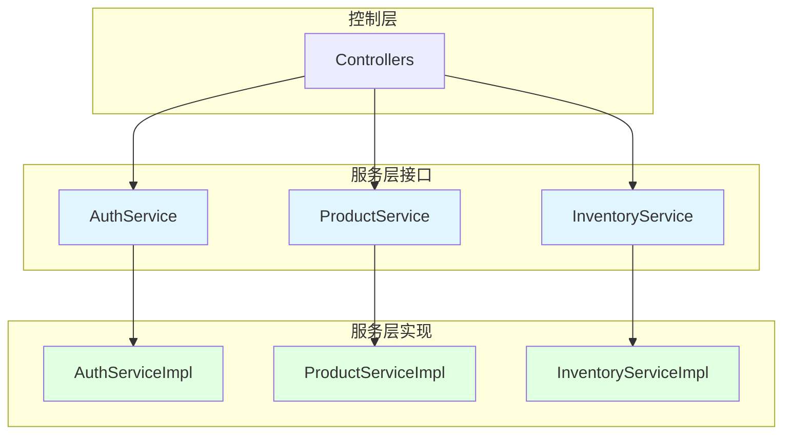

**为什么要接口和实现分离**：

如果只有实现类没有接口：
- 控制器直接依赖具体实现
- 换实现方式需要改控制器代码
- 难以进行单元测试（无法 mock）

接口和实现分离的好处：
- 控制器只依赖接口，不依赖具体实现
- 换实现方式只需要新增一个实现类
- 可以方便地进行单元测试

**核心服务说明**：

1. **InventoryService**（最重要）
   - 入库：增加库存、生成入库记录
   - 出库：减少库存、生成出库记录
   - 核心业务规则都在这里

2. **PersistenceService**
   - 启动时加载数据文件
   - 关键操作后保存数据
   - 数据恢复的保证

3. **AuthService**
   - 登录校验
   - 权限判断（能不能做某操作）

**代码示例讲解**：

打开 `InventoryServiceImpl.java`，这是整个系统业务规则最复杂的地方。我们来仔细拆解。

```java
// 第 26-29 行：成员变量
private final WmsDataStore dataStore;
private final PersistenceService persistenceService;
private final LogService logService;
```

库存服务需要三个依赖：
- `dataStore`：操作内存中的商品和记录
- `persistenceService`：把数据保存到文件
- `logService`：记录操作日志

---

```java
// 第 45-53 行：入库和出库方法
@Override
public StockRecord stockIn(String productId, int quantity, String operator, String remark) {
    return changeStock(productId, quantity, operator, remark, StockRecordType.IN);
}

@Override
public StockRecord stockOut(String productId, int quantity, String operator, String remark) {
    return changeStock(productId, quantity, operator, remark, StockRecordType.OUT);
}
```

这两个方法表面上是两个业务入口，但实际上它们都调用了同一个方法 `changeStock()`，唯一的区别是最后一个参数：`StockRecordType.IN` 或 `StockRecordType.OUT`。

**为什么要这样设计？**

因为入库和出库的核心逻辑几乎一样：
1. 校验商品是否存在、是否启用
2. 校验数量是否合法
3. 计算库存变化
4. 保存数据
5. 记录日志

唯一的区别是：入库是”库存 + 数量”，出库是”库存 - 数量”。

把共同逻辑抽到一个方法里，差异点用参数表示 —— 这就是”公共主流程抽取”。

---

**接下来看 `changeStock()` 方法，这是整个库存操作的核心**：

```java
// 第 106-112 行：第一步 —— 校验商品是否存在
private StockRecord changeStock(...) {
    Product product = dataStore.getProductsById().get(productId);
    if (product == null) {
        logService.warn(operator, “STOCK”, type.name(), “操作失败，原因：商品不存在”);
        throw new BizException(“商品不存在：” + productId);
    }
```

第一步是从数据仓库里取出商品对象，如果取不到（`null`），说明商品编号不存在，直接抛异常。

**注意**：这里先写日志再抛异常，确保即使业务失败，系统也留下了”为什么失败”的记录。

---

```java
// 第 113-116 行：第二步 —— 校验商品状态
if (product.getStatus() == ProductStatus.DISABLED) {
    logService.warn(operator, “STOCK”, type.name(), “操作失败，原因：商品已停用”);
    throw new BizException(“停用商品禁止继续进出库。”);
}
```

商品存在不代表能操作，如果商品已经停用（`DISABLED`），也不允许出入库。

---

```java
// 第 117-120 行：第三步 —— 校验数量
if (quantity <= 0) {
    logService.warn(operator, “STOCK”, type.name(), “操作失败，原因：数量必须大于 0”);
    throw new BizException(“数量必须大于 0。”);
}
```

数量必须是正整数。0 或负数都不合理。

---

```java
// 第 121-124 行：第四步 —— 校验备注长度
if (remark != null && remark.trim().length() > 50) {
    logService.warn(operator, “STOCK”, type.name(), “操作失败，原因：备注长度超限”);
    throw new BizException(“备注长度不能超过 50。”);
}
```

备注不是必填的（可以为 `null`），但如果填写了，长度不能超过 50 个字符。这是为了防止备注过长影响文件存储。

---

```java
// 第 126-131 行：第五步 —— 计算库存变化，校验库存是否充足
int beforeStock = product.getStock();
int afterStock = type == StockRecordType.IN ? beforeStock + quantity : beforeStock - quantity;
if (afterStock < 0) {
    logService.warn(operator, “STOCK”, type.name(), “操作失败，原因：库存不足”);
    throw new StockNotEnoughException(“库存不足，当前库存：” + beforeStock);
}
```

这一段是库存业务的核心：
- `beforeStock` 是操作前的库存
- `afterStock` 是操作后的库存
- 如果是入库（`IN`），库存增加；如果是出库（`OUT`），库存减少
- 出库时如果库存变成负数，说明库存不足，抛出专门的 `StockNotEnoughException` 异常

**注意**：这里保存了 `beforeStock` 和 `afterStock`，后面生成库存记录时会用到 —— 这样记录里就完整保留了”这次操作前后库存各是多少”。

---

```java
// 第 133-135 行：第六步 —— 创建快照
Map<String, Product> productSnapshot = dataStore.snapshotProducts();
List<StockRecord> recordSnapshot = dataStore.snapshotStockRecords();
```

这是非常关键的一步！在真正修改数据之前，先把当前状态”拍个照”。

**为什么要这样？**

因为接下来的操作可能会失败（比如写文件时磁盘满了、权限不够等）。如果没有快照，内存数据已经改了，但文件没写成功，就会出现”数据不一致”的问题。

有了快照，如果后续操作失败，可以把内存数据恢复到操作前的状态 —— 这就是”回滚”机制。

---

```java
// 第 137-151 行：第七步 —— 修改内存数据，创建记录
product.setStock(afterStock);
product.setLastModified(DateTimeUtil.now());

StockRecord record = new StockRecord(
    IdUtil.nextId(...),
    product.getId(),
    type,
    quantity,
    beforeStock,
    afterStock,
    operator,
    DateTimeUtil.now(),
    remark == null ? “” : remark.trim()
);
dataStore.addStockRecord(record);
```

这里做三件事：
1. 修改商品的库存数量和最后修改时间
2. 创建一条库存记录对象，保存完整的操作信息
3. 把记录添加到数据仓库

**注意**：此时内存数据已经改了，但文件还没写 —— 所以接下来必须确保文件写入成功。

---

```java
// 第 153-164 行：第八步 —— 保存文件，失败则回滚
try {
    persistenceService.saveProducts();
    persistenceService.saveStockRecords();
} catch (BizException ex) {
    dataStore.replaceProducts(productSnapshot);
    dataStore.replaceStockRecords(recordSnapshot);
    logService.error(operator, “STOCK”, type.name(), “数据保存失败，已回滚：” + ex.getMessage());
    throw ex;
}
```

这是”事务保证”的核心逻辑：
1. 先保存商品文件，再保存记录文件
2. 如果任何一个保存失败，就立即回滚内存数据（恢复快照）
3. 回滚后重新抛出异常，让上层知道操作失败了

**为什么要先保存商品再保存记录？**

因为记录是”操作日志”，商品是”主数据”。如果只能保存一个，宁肯记录丢失，也要保证主数据正确。

---

```java
// 第 166-173 行：第九步 —— 成功，记录日志并返回
String detail = String.format(“商品 %s %s %d 件，库存 %d -> %d”,
    product.getId(),
    type == StockRecordType.IN ? “入库” : “出库”,
    quantity,
    beforeStock,
    afterStock);
logService.info(operator, “STOCK”, type.name(), detail);
return record.copy();
```

走到这一步，说明整个操作成功了：
1. 写一条成功日志
2. 返回库存记录的**副本**（`record.copy()`）

**为什么返回副本而不是原对象？**

因为原对象存在数据仓库里，如果返回原对象，外部代码可能会直接修改它，导致仓库数据被意外改动。

---

**总结一下 `changeStock()` 的完整流程**：

| 阶段 | 做什么 | 目的 |
|------|--------|------|
| 1-4 | 校验商品、数量、备注 | 过滤掉不合法的请求 |
| 5 | 计算库存变化，校验库存是否充足 | 确保业务规则成立 |
| 6 | 创建快照 | 为可能的回滚做准备 |
| 7 | 修改内存数据 | 更新业务状态 |
| 8 | 保存文件，失败则回滚 | 确保数据持久化成功 |
| 9 | 记录日志，返回结果 | 留下操作痕迹 |

这个流程正好体现了服务层的核心职责：**定义业务规则、执行数据校验、保证数据一致性**。

**核心要点**：

- 服务层分为接口与实现两部分。
- 接口负责定义能力，例如“需要有入库方法”“需要有查询方法”。
- 实现类负责定义具体做法，例如如何校验、如何修改数据、如何写入文件。
- 这样做的价值在于：调用方依赖的是接口，而不是具体实现。
- 如果未来希望把文件存储替换为数据库存储，通常只需新增新的实现类，而不必修改控制层和服务接口。

---

### 7. store/ 数据存储层

**文件**：`WmsDataStore`

**职责**：
- 集中管理运行期所有内存数据
- 提供统一的数据访问接口
- 支持快照回滚机制

**设计思想**：

所有共享数据都集中放在这一个类中。

服务层不直接分散持有数据，而是统一通过 `DataStore` 访问，这样更便于集中管理，也更便于实现快照回滚。

**数据结构设计**：

```java
// 用户数据：用户名 → 用户对象
Map<String, User> usersByUsername;

// 商品数据：商品编号 → 商品对象
Map<String, Product> productsById;

// 库存记录：保持时间顺序
List<StockRecord> stockRecords;

// 商品对应记录：商品编号 → 该商品的记录列表
Map<String, List<StockRecord>> stockRecordsByProductId;
```

**为什么这样选择集合类型**：

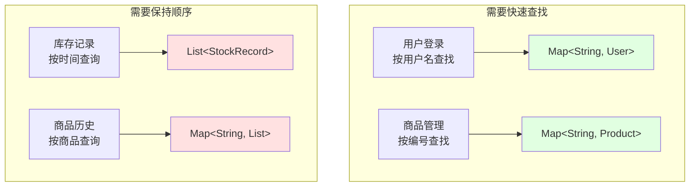

**访问模式对比**：

| 操作 | 用 Map | 用 List |
|------|--------|---------|
| 按编号查找商品 | O(1) 直接定位 | O(n) 遍历查找 |
| 按用户名登录 | O(1) 直接定位 | O(n) 遍历查找 |
| 查询所有记录 | - | O(1) 顺序访问 |
| 保持时间顺序 | 需额外排序 | 天然有序 |

**快照回滚机制**：

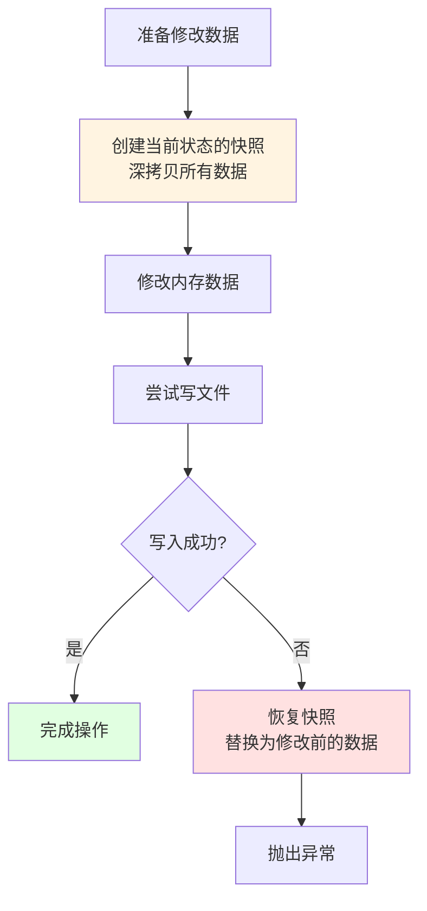

**代码示例讲解**：

打开 `WmsDataStore.java`，这个类是整个系统的”内存数据库”。我们来逐行拆解。

```java
// 第 17-23 行：四个核心数据结构
private final Map<String, User> usersByUsername = new LinkedHashMap<>();
private final Map<String, Product> productsById = new LinkedHashMap<>();
private final List<StockRecord> stockRecords = new ArrayList<>();
private final Map<String, List<StockRecord>> stockRecordsByProductId = new LinkedHashMap<>();
```

这四个数据结构的设计很有讲究，我们一个个来看。

---

**第一个：`usersByUsername` —— 用户数据**

```java
private final Map<String, User> usersByUsername = new LinkedHashMap<>();
```

- **为什么用 Map？** 因为登录是按用户名查找的。用 Map 可以 O(1) 时间直接定位到用户对象。
- **为什么用 `LinkedHashMap`？** 而不是 `HashMap`？因为 `LinkedHashMap` 保持插入顺序，遍历时按用户添加顺序输出，体验更好。
- **Key 为什么是 `String`（用户名）？** 因为用户名是唯一的，用用户名做 Key 最自然。

**对比一下如果用 List**：
```java
// 用 List：查找需要遍历，O(n)
for (User user : users) {
    if (user.getUsername().equals(“admin”)) {
        return user;
    }
}

// 用 Map：直接获取，O(1)
return usersByUsername.get(“admin”);
```

---

**第二个：`productsById` —— 商品数据**

```java
private final Map<String, Product> productsById = new LinkedHashMap<>();
```

设计和用户数据类似：
- **Key 是商品编号**，因为商品编号是唯一标识
- 入库出库时都要按商品编号查找商品，用 Map 最快

---

**第三个：`stockRecords` —— 库存记录总表**

```java
private final List<StockRecord> stockRecords = new ArrayList<>();
```

- **为什么用 List？** 因为库存记录有天然的时间顺序，新增的记录排在后面。
- 查询”所有记录”或”按时间排序”时，List 直接遍历就行，不需要额外排序。

**如果用 Map 会怎样？** Map 是无序的，要按时间查询还得额外维护一个时间戳索引，反而复杂。

---

**第四个：`stockRecordsByProductId` —— 按商品分组的记录索引**

```java
private final Map<String, List<StockRecord>> stockRecordsByProductId = new LinkedHashMap<>();
```

这是一个**索引结构**，用来快速查询”某个商品的所有记录”。

**为什么要这个索引？**

如果没有这个索引，查询某个商品的记录需要：
```java
// 遍历所有记录，逐个判断
List<StockRecord> result = new ArrayList<>();
for (StockRecord record : stockRecords) {
    if (record.getProductId().equals(“P001”)) {
        result.add(record);
    }
}
```

有了索引，直接：
```java
// O(1) 定位到该商品的记录列表
return stockRecordsByProductId.get(“P001”);
```

**这是典型的”空间换时间”设计**：多存一份数据，换取更快的查询速度。

---

**现在来看快照相关的方法**：

```java
// 第 72-85 行：三个快照方法
public Map<String, User> snapshotUsers() {
    return deepCopyUsers(usersByUsername);
}

public Map<String, Product> snapshotProducts() {
    return deepCopyProducts(productsById);
}

public List<StockRecord> snapshotStockRecords() {
    return deepCopyRecords(stockRecords);
}
```

这三个方法返回的是”深拷贝”（deep copy），不是原数据的引用。

**什么叫深拷贝？**

```java
// 浅拷贝（错误做法）
Map<String, User> copy = usersByUsername;  // 只是指向同一个 Map

// 深拷贝（正确做法）
Map<String, User> copy = new LinkedHashMap<>();
for (User user : usersByUsername.values()) {
    copy.put(user.getUsername(), user.copy());  // 每个对象也复制一份
}
```

深拷贝后，修改副本不会影响原数据 —— 这正是快照需要的：确保”原数据”和”修改后的数据”完全独立。

---

**看 `deepCopyProducts()` 的具体实现**：

```java
// 第 95-100 行
private Map<String, Product> deepCopyProducts(Map<String, Product> source) {
    Map<String, Product> copied = new LinkedHashMap<>();
    for (Map.Entry<String, Product> entry : source.entrySet()) {
        copied.put(entry.getKey(), entry.getValue().copy());
    }
    return copied;
}
```

这段代码的逻辑：
1. 创建一个新的 `LinkedHashMap`
2. 遍历原 Map 的每个条目
3. 调用 `entry.getValue().copy()` 得到 Product 对象的副本
4. 把 Key 和副本放入新 Map

**注意**：这里调用了 `Product.copy()` 方法，说明 Product 类必须提供拷贝功能。

---

**再看 `replaceProducts()` 方法**：

```java
// 第 47-50 行
public void replaceProducts(Map<String, Product> products) {
    productsById.clear();
    productsById.putAll(deepCopyProducts(products));
}
```

这个方法用于”整体替换”商品数据，典型场景是：
1. 数据加载时：从文件读取的数据替换到仓库
2. 回滚时：用快照数据替换被修改的数据

**注意**：`putAll()` 之前先 `clear()`，确保原数据被完全清空。

---

**最后看 `addStockRecord()` 方法**：

```java
// 第 59-65 行
public void addStockRecord(StockRecord stockRecord) {
    StockRecord recordCopy = stockRecord.copy();
    stockRecords.add(recordCopy);
    stockRecordsByProductId.computeIfAbsent(recordCopy.getProductId(), key -> new ArrayList<>())
            .add(recordCopy);
}
```

这个方法做了两件事：
1. 把记录添加到总表 `stockRecords`
2. 同时更新按商品分组的索引 `stockRecordsByProductId`

**关键点**：
- 添加的是**副本**（`recordCopy`），防止外部修改仓库数据
- `computeIfAbsent()` 是个很有用的方法：如果 Key 不存在就创建一个空 ArrayList，然后添加记录

---

**总结一下 `WmsDataStore` 的设计要点**：

| 设计决策 | 原因 |
|----------|------|
| 用户用 Map | 按用户名登录，需要 O(1) 查找 |
| 商品用 Map | 按编号查询，需要 O(1) 查找 |
| 记录用 List | 有时间顺序，需要遍历展示 |
| 额外维护按商品分组的索引 | 快速查询某个商品的历史 |
| 快照返回深拷贝 | 确保回滚时数据独立 |
| 添加记录时同时更新索引 | 保持主数据和索引一致 |

这个类正好说明：**数据仓库不是简单的”容器集合”，而是按访问模式精心设计的数据结构**。

**核心要点**：

为什么用户和商品用 Map，记录用 List？

- 用户登录需要按用户名查找，用 Map 是 O(1)，用 List 要 O(n) 遍历
- 商品管理需要按编号查找，同样用 Map 更快
- 库存记录天然有顺序，要按时间查询，用 List 更合适

集合类型不是统一固定的，而是由访问方式决定：

- 需要快速定位的场景，优先使用 `Map`
- 需要保持顺序的场景，优先使用 `List`
- 关键操作前先创建快照，失败后再恢复，可以保证内存和磁盘数据一致

---

### 8. util/ 工具层

**文件**：
- `InputUtil` - 输入处理（读取、校验）
- `DateTimeUtil` - 时间格式化
- `FileUtil` - 文件操作
- `IdUtil` - ID 生成

**职责**：
- 提供跨层使用的通用能力
- 封装重复代码
- 统一处理逻辑

**设计思想**：

重复使用的能力统一抽取为工具类。

它们不属于任何单一业务层，因此可以被各层安全复用。

**工具类使用示例**：

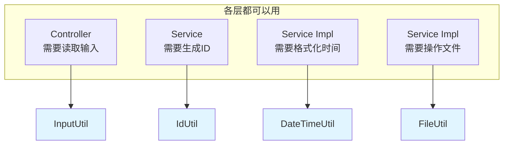

**代码示例讲解**：

打开 `FileUtil.java`，这个工具类负责所有文件操作和文本格式处理。我们先来看基础文件操作部分。

```java
// 第 24-36 行：ensureDirectory —— 确保目录存在
public static void ensureDirectory(String directory) {
    ensureDirectory(Paths.get(directory));
}

public static void ensureDirectory(Path path) {
    try {
        if (Files.notExists(path)) {
            Files.createDirectories(path);
        }
    } catch (IOException ex) {
        throw new IllegalStateException(“创建目录失败: “ + path, ex);
    }
}
```

这个方法的逻辑很简单：
1. 检查目录是否存在
2. 不存在就创建（`createDirectories` 会创建所有必需的父目录）
3. 创建失败就抛异常

**为什么要这个方法？**

因为后续读写文件时，如果目录不存在会直接报错。在操作前先调用 `ensureDirectory()`，可以避免这个问题。

---

```java
// 第 38-59 行：ensureFile —— 确保文件存在
public static void ensureFile(Path path, List<String> initialLines) {
    Path parent = path.getParent();
    if (parent != null) {
        ensureDirectory(parent);  // 先确保父目录存在
    }
    try {
        if (Files.notExists(path)) {
            Files.write(path, initialLines, StandardCharsets.UTF_8,
                StandardOpenOption.CREATE, StandardOpenOption.WRITE);
        }
    } catch (IOException ex) {
        throw new IllegalStateException(“创建文件失败: “ + path, ex);
    }
}
```

这个方法会：
1. 先检查父目录，不存在就创建
2. 然后检查文件，不存在就创建并写入初始内容

**注意**：如果文件已经存在，这个方法什么都不做，不会覆盖已有数据。

---

```java
// 第 69-76 行：readAllLines —— 读取文件所有行
public static List<String> readAllLines(Path path) {
    try {
        ensureFile(path);  // 确保文件存在
        return Files.readAllLines(path, StandardCharsets.UTF_8);
    } catch (IOException ex) {
        throw new IllegalStateException(“读取文件失败: “ + path, ex);
    }
}
```

读取前先调用 `ensureFile(path)`，这样即使文件不存在也会自动创建空文件，而不是直接报错。

---

```java
// 第 86-95 行：writeAllLines —— 覆盖写入
public static void writeAllLines(Path path, List<String> lines) {
    ensureFile(path);
    try {
        Files.write(path, lines == null ? List.of() : lines, StandardCharsets.UTF_8,
            StandardOpenOption.TRUNCATE_EXISTING, StandardOpenOption.WRITE);
    } catch (IOException ex) {
        throw new IllegalStateException(“写入文件失败: “ + path, ex);
    }
}
```

**关键参数**：`StandardOpenOption.TRUNCATE_EXISTING` —— 这表示”清空原文件内容后写入”，也就是覆盖模式。

**为什么不用追加？**

因为保存数据快照时，需要保证文件内容和当前内存完全一致，追加会导致文件里有旧数据残留。

---

**接下来看文本格式相关的部分**：

这个项目用了一种自定义的文本格式来存储对象，一行代表一个对象，格式是：
```
key1=value1|key2=value2|key3=value3
```

比如一个商品可能存成：
```
id=P001|name=iPhone|category=手机|price=5999|stock=100
```

**问题来了**：如果商品名称里就有 `|` 或 `=` 怎么办？

这就需要”转义”机制。

---

```java
// 第 117-135 行：escape —— 转义特殊字符
public static String escape(String raw) {
    if (raw == null) {
        return “”;
    }
    StringBuilder builder = new StringBuilder();
    for (char ch : raw.toCharArray()) {
        if (ch == '\\' || ch == '|' || ch == '=') {
            builder.append('\\');  // 先加反斜杠
        }
        if (ch == '\n' || ch == '\r') {
            builder.append(' ');  // 换行符替换成空格
        } else {
            builder.append(ch);
        }
    }
    return builder.toString();
}
```

这段代码的逻辑：
- 遇到 `\`、`|`、`=` 三个特殊字符，先加一个 `\` 转义
- 遇到换行符，替换成空格（避免一行变成两行）
- 其他字符直接保留

**举例**：
- 原文：`iPhone|Pro` → 转义后：`iPhone\|Pro`
- 原文：`价格=100` → 转义后：`价格\=100`
- 原文：`路径\C:\temp` → 转义后：`路径\\C:\temp`

---

```java
// 第 141-165 行：unescape —— 还原转义
public static String unescape(String encoded) {
    if (encoded == null || encoded.isEmpty()) {
        return “”;
    }
    StringBuilder builder = new StringBuilder();
    boolean escaping = false;  // 标记是否处于转义状态
    for (char ch : encoded.toCharArray()) {
        if (escaping) {
            builder.append(ch);  // 转义状态下的字符直接保留
            escaping = false;
            continue;
        }
        if (ch == '\\') {
            escaping = true;  // 遇到反斜杠，进入转义状态
            continue;
        }
        builder.append(ch);
    }
    if (escaping) {
        builder.append('\\');  // 最后一个字符是反斜杠，保留它
    }
    return builder.toString();
}
```

这是一个”状态机”实现：
- 正常状态下，遇到 `\` 就进入转义状态
- 转义状态下，下一个字符直接保留（不管它是特殊字符还是普通字符）

**举例**：
- `iPhone\|Pro` → 还原成 `iPhone|Pro`
- `价格\=100` → 还原成 `价格=100`

---

```java
// 第 213-232 行：parseKeyValueLine —— 解析一行文本为键值对
public static Map<String, String> parseKeyValueLine(String line) {
    Map<String, String> result = new LinkedHashMap<>();
    if (line == null || line.trim().isEmpty()) {
        return result;
    }
    // 先按 | 切分成多个 key=value 部分
    for (String part : splitEscaped(line, '|')) {
        if (part.isBlank()) {
            continue;
        }
        // 再按 = 切分成 key 和 value
        int index = findUnescapedChar(part, '=');
        if (index < 0) {
            continue;
        }
        String key = unescapeField(part.substring(0, index).trim());
        String value = unescapeField(part.substring(index + 1));
        result.put(key, value);
    }
    return result;
}
```

这个方法把一行文本解析成 Map，比如：
```
id=P001|name=iPhone|price=5999
```
解析成：
```java
{“id”: “P001”, “name”: “iPhone”, “price”: “5999”}
```

**关键点**：使用 `splitEscaped()` 和 `findUnescapedChar()` 而不是直接用 `String.split()`，因为被转义的分隔符不应该参与切分。

---

```java
// 第 234-251 行：buildKeyValueLine —— 把键值对序列化成一行文本
public static String buildKeyValueLine(Map<String, String> fields) {
    if (fields == null || fields.isEmpty()) {
        return “”;
    }
    StringBuilder builder = new StringBuilder();
    boolean first = true;
    for (Map.Entry<String, String> entry : fields.entrySet()) {
        if (!first) {
            builder.append('|');  // 字段之间用 | 分隔
        }
        first = false;
        builder.append(escapeField(entry.getKey()));   // Key 要转义
        builder.append('=');
        builder.append(escapeField(entry.getValue())); // Value 也要转义
    }
    return builder.toString();
}
```

这个方法和 `parseKeyValueLine()` 是**互逆操作**：
- `parseKeyValueLine()` 把文本拆成 Map
- `buildKeyValueLine()` 把 Map 拼成文本

**举例**：
```java
Map<String, String> map = new LinkedHashMap<>();
map.put(“id”, “P001”);
map.put(“name”, “iPhone|Pro”);  // 名称里有特殊字符
String line = buildKeyValueLine(map);
// 结果：id=P001|name=iPhone\|Pro
```

---

**总结一下 `FileUtil` 的职责**：

1. **文件操作**：创建目录、读写文件，统一处理编码和异常
2. **文本格式定义**：定义了项目的存储格式（`key=value|key=value`）
3. **转义机制**：处理特殊字符，确保格式可逆
4. **序列化/反序列化**：在对象和文本之间转换

这个类说明：**工具层不只是零散方法的集合，而是围绕一套统一的数据格式提供完整支持**。

**核心要点**：

- 工具类提供的是跨层复用的通用能力，例如输入处理、时间格式化、文件操作和 ID 生成。
- 它们不直接承载业务规则，因此不属于某一个具体业务层。
- 统一抽取到工具层后，可以减少重复代码，并保持处理逻辑一致。

---

## 核心业务流程

### 入库/出库完整流程

这是系统最重要的业务逻辑。

这一部分最能体现各层如何协同完成一次完整业务操作。

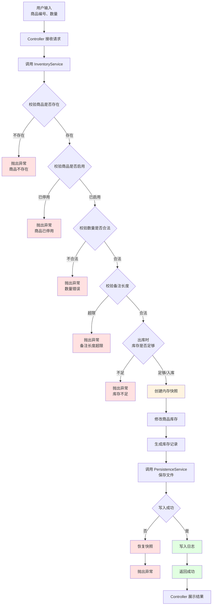

**流程要点**：

1. **多层校验**：商品存在性 → 商品状态 → 数量合法性 → 备注长度 → 库存充足性
2. **快照保护**：修改前先保存当前状态
3. **事务保证**：要么全成功，要么回滚到原点
4. **日志留痕**：成功后记录操作

**入库和出库的差异**：

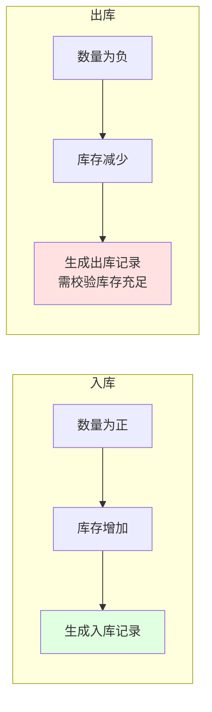

**核心要点**：

- 入库和出库共用一条主流程，区别主要在于库存增减方向不同。
- 这种抽象方式可以提高代码复用度，并保证两类操作遵循一致的校验规则。
- 关键操作前先创建快照，写入失败时立即回滚。
- 因此系统能够保证数据一致性：要么全部成功，要么恢复到修改前状态。

---

## 数据持久化

### 文件结构

```
data/
├── users.txt              # 用户数据
├── products.txt           # 商品数据
└── stock_records.txt      # 库存记录

logs/
└── system.log             # 系统日志
```

### 数据格式

**users.txt**：
```
#version=1
[USERS]
id=U001|username=admin|password=123456|role=ADMIN|status=ACTIVE
id=U002|username=tom|password=123456|role=OPERATOR|status=ACTIVE
```

**products.txt**：
```
#version=1
[PRODUCTS]
id=P001|name=机械键盘|category=外设|price=299.00|stock=18|alertStock=5|status=ACTIVE|lastModified=2026-03-22T15:13:18
```

**stock_records.txt**：
```
#version=1
[STOCK_RECORDS]
id=R001|productId=P001|type=IN|quantity=20|beforeStock=0|afterStock=20|operator=admin|operateTime=2026-03-22T15:13:18|remark=首次入库
```

**system.log**：
```
2026-03-22 15:13:18 | admin | AUTH | LOGIN | INFO | SUCCESS
2026-03-22 15:13:18 | admin | STOCK | OUT | INFO | 商品 P001 出库 2 件，库存 20 -> 18
```

---

### 持久化职责

**文件**：`FilePersistenceServiceImpl`

**职责**：
- 程序启动时加载数据文件
- 关键操作后保存数据
- 处理文件不存在的情况
- 容错处理（坏行跳过）

### 启动加载流程

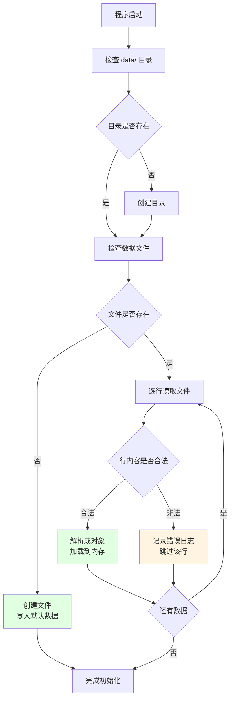

### 数据保存时机

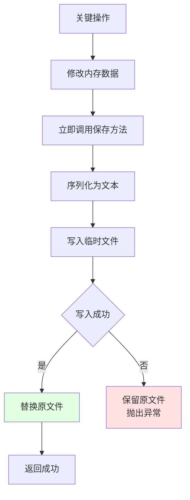

**为什么立即保存**：

- 保证数据不丢失（程序异常关闭也能恢复）
- 避免批量操作失败导致全部丢失
- 简化实现（不需要缓存机制）

**核心要点**：

- 程序启动时会自动检查数据文件：不存在就创建，存在就加载。
- 读取过程中如果遇到坏行，不会直接导致系统崩溃，而是记录日志并跳过异常数据。
- 关键操作完成后会立即写入文件，从而保证程序关闭后数据不会丢失。
- 虽然频繁写文件会带来一定性能开销，但对于课程项目而言，`简单`、`稳定`、`可靠` 更重要。

