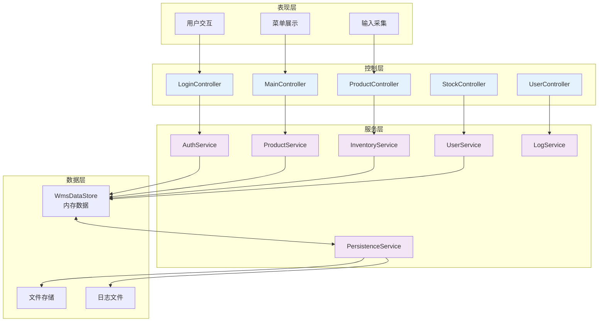
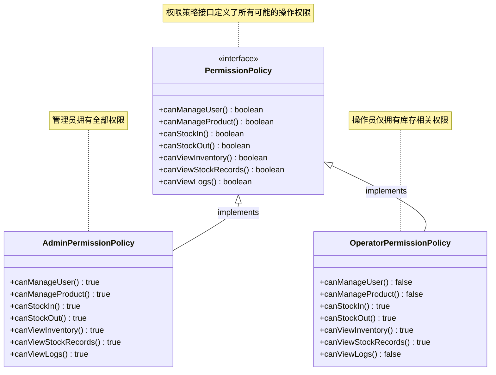
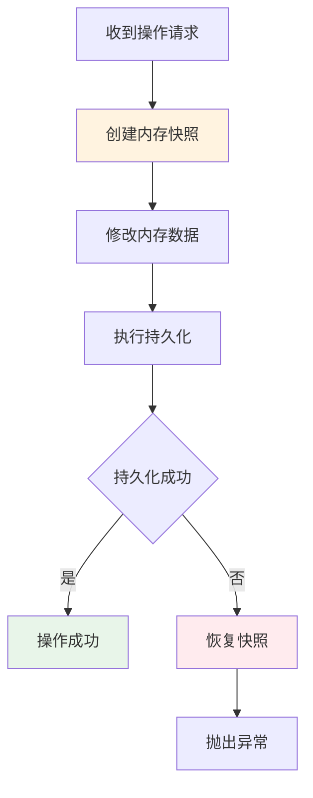
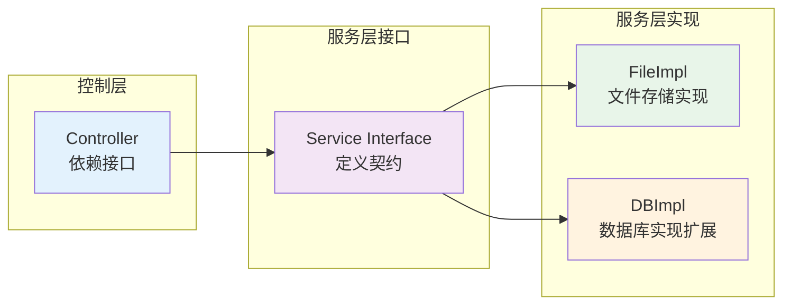
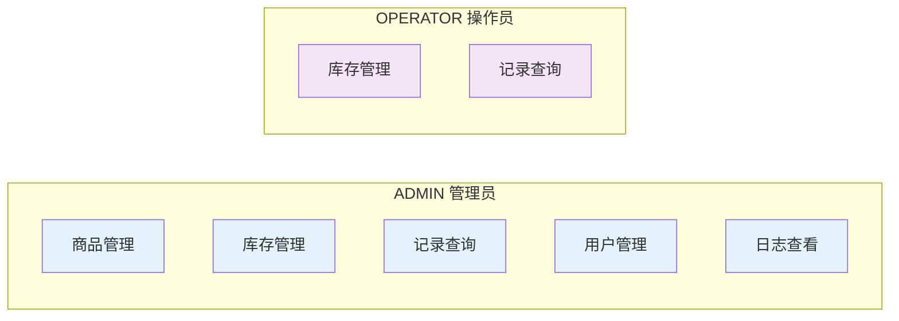
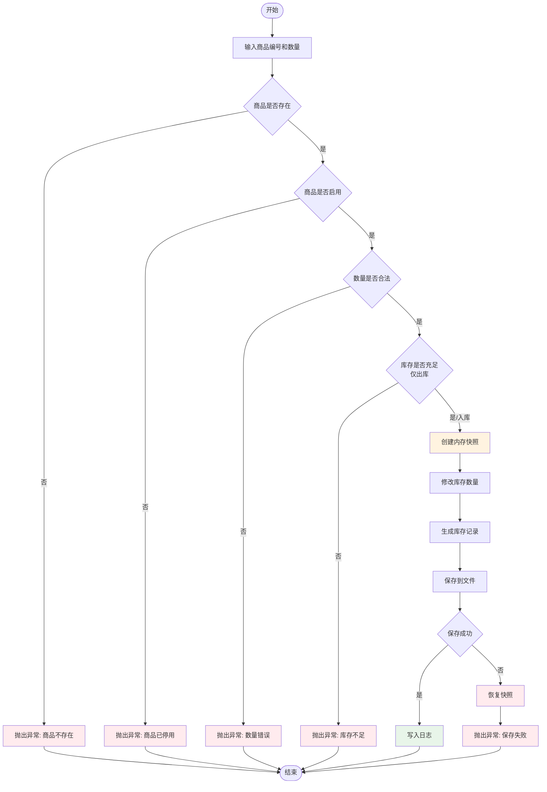
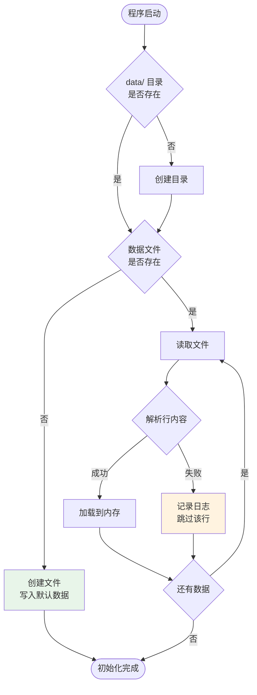
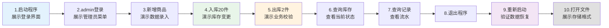

# 仓库进销存管理系统

<div align="center">
  <p><strong>一个基于 JavaSE 的分层式仓库管理系统</strong></p>

  <p>
    <a href="https://www.oracle.com/java/">
      
    </a>
    <a href="./LICENSE">
      
    </a>
  </p>
</div>

---

## 摘要

本项目是一个基于 JavaSE 的控制台版仓库进销存管理系统，旨在展示如何将课程中的核心知识点应用于实际项目开发。项目采用分层架构设计，实现了用户权限管理、商品管理、库存操作、数据持久化和日志记录等完整功能，适合作为课程设计、教学演示和项目答辩的参考案例。

### 核心特性

- **分层架构设计** - 控制层、服务层、数据层职责分离
- **接口驱动开发** - 面向接口编程，易于扩展和维护
- **策略模式应用** - 权限控制采用策略模式，支持多角色管理
- **快照回滚机制** - 关键操作支持事务性回滚，保证数据一致性
- **文件持久化** - 基于文本文件的数据存储，支持程序重启后数据恢复
- **完整日志系统** - 记录关键操作，支持问题追踪和审计
- **异常处理体系** - 自定义异常类型，统一的异常处理机制

---

## 目录

- [系统架构](#系统架构)
- [功能模块](#功能模块)
- [技术栈](#技术栈)
- [项目结构](#项目结构)
- [核心设计](#核心设计)
- [角色与权限](#角色与权限)
- [业务流程](#业务流程)
- [数据存储](#数据存储)
- [快速开始](#快速开始)
- [演示指南](#演示指南)
- [教学价值](#教学价值)
- [扩展方向](#扩展方向)

---

## 系统架构

### 分层设计

系统采用经典的三层架构，各层职责清晰，耦合度低。



### 架构优势

| 特性 | 说明 |
|------|------|
| **高内聚低耦合** | 各层职责明确，层间依赖接口而非实现 |
| **易于测试** | 接口驱动设计便于单元测试和 Mock |
| **可扩展性强** | 新增功能无需修改现有代码 |
| **易于维护** | 分层清晰，问题定位和代码修改更便捷 |

---

## 功能模块

### 已实现功能

#### 用户管理
- 用户登录/退出
- 角色区分（管理员/操作员）
- 用户状态管理（启用/停用）
- 密码验证

#### 商品管理
- 商品新增
- 商品信息修改
- 商品删除/停用
- 商品查询（按编号、名称、分类）
- 商品排序（按价格、库存）

#### 库存管理
- 商品入库
- 商品出库
- 库存数量校验
- 低库存预警
- 库存变更记录

#### 记录查询
- 进出库流水查询
- 按商品筛选
- 按类型筛选（入库/出库）
- 按操作员筛选
- 记录排序（按时间、数量）

#### 数据持久化
- 自动初始化数据目录
- 数据文件加载与恢复
- 关键操作实时落盘
- 坏行容错处理

#### 日志系统
- 操作日志记录
- 日志级别分类（INFO/WARNING/ERROR）
- 日志文件输出

---

## 技术栈

| 技术 | 版本 | 说明 |
|------|------|------|
| Java | 17+ | 编程语言 |
| JavaSE | - | 控制台应用 |
| 文本文件 | - | 数据存储 |
| UTF-8 | - | 文件编码 |

### 设计模式应用

- **策略模式** - 权限策略
- **依赖注入** - 对象装配
- **工厂模式** - 部分工具类
- **模板方法** - 服务层基础类

---

## 项目结构

```
Warehouse Inventory Management System
├── src/com/demo/wms
│   ├── app/                          # 程序入口
│   │   └── Application.java
│   │
│   ├── controller/                   # 控制层
│   │   ├── LoginController.java      # 登录流程
│   │   ├── MainController.java       # 主菜单调度
│   │   ├── ProductController.java    # 商品管理
│   │   ├── StockController.java      # 库存操作
│   │   └── UserController.java       # 用户管理
│   │
│   ├── service/                      # 服务层
│   │   ├── AuthService.java          # 认证服务接口
│   │   ├── ProductService.java       # 商品服务接口
│   │   ├── InventoryService.java     # 库存服务接口
│   │   ├── UserService.java          # 用户服务接口
│   │   ├── LogService.java           # 日志服务接口
│   │   ├── PersistenceService.java   # 持久化服务接口
│   │   └── impl/                     # 服务实现
│   │       ├── AuthServiceImpl.java
│   │       ├── ProductServiceImpl.java
│   │       ├── InventoryServiceImpl.java
│   │       ├── UserServiceImpl.java
│   │       ├── FileLogServiceImpl.java
│   │       ├── FilePersistenceServiceImpl.java
│   │       └── ServiceSupport.java   # 服务基类
│   │
│   ├── entity/                       # 实体层
│   │   ├── User.java                 # 用户实体
│   │   ├── Product.java              # 商品实体
│   │   ├── StockRecord.java          # 库存记录
│   │   └── OperationLog.java         # 操作日志
│   │
│   ├── enums/                        # 枚举定义
│   │   ├── Role.java                 # 角色
│   │   ├── UserStatus.java           # 用户状态
│   │   ├── ProductStatus.java        # 商品状态
│   │   ├── StockRecordType.java      # 记录类型
│   │   └── LogLevel.java             # 日志级别
│   │
│   ├── permission/                   # 权限策略
│   │   ├── PermissionPolicy.java     # 权限策略接口
│   │   ├── AdminPermissionPolicy.java      # 管理员权限
│   │   └── OperatorPermissionPolicy.java  # 操作员权限
│   │
│   ├── store/                        # 数据存储
│   │   └── WmsDataStore.java         # 内存数据仓库
│   │
│   ├── exception/                    # 异常定义
│   │   ├── BizException.java         # 业务异常基类
│   │   ├── LoginException.java       # 登录异常
│   │   ├── PermissionDeniedException.java  # 权限异常
│   │   ├── StockNotEnoughException.java    # 库存不足异常
│   │   └── DataParseException.java         # 数据解析异常
│   │
│   └── util/                         # 工具类
│       ├── InputUtil.java            # 输入处理
│       ├── DateTimeUtil.java         # 时间工具
│       ├── FileUtil.java             # 文件操作
│       └── IdUtil.java               # ID 生成
│
├── data/                             # 数据目录（自动创建）
│   ├── users.txt                     # 用户数据
│   ├── products.txt                  # 商品数据
│   └── stock_records.txt             # 库存记录
│
├── logs/                             # 日志目录（自动创建）
│   └── system.log                    # 系统日志
│
├── README.md                         # 项目说明
├── PRESENTATION_GUIDE.md             # 讲解指南
└── RPD.md                            # 需求文档
```

---

## 核心设计

### 1. 集合结构设计

系统根据不同的访问模式选择合适的数据结构：

| 数据对象 | 集合类型 | 选择原因 |
|---------|---------|---------|
| 用户 | `Map<String, User>` | 按用户名登录，需要 O(1) 快速查找 |
| 商品 | `Map<String, Product>` | 按编号管理，需要 O(1) 快速定位 |
| 库存记录 | `List<StockRecord>` | 保持时间顺序，支持排序 |
| 商品记录索引 | `Map<String, List<StockRecord>>` | 快速查询某商品的完整历史 |

### 2. 权限策略设计

采用策略模式实现权限控制，不同角色对应不同的权限策略实现。



**设计优势**：
- 权限逻辑集中管理
- 新增角色只需新增实现类
- 符合开闭原则（对扩展开放，对修改关闭）

### 3. 快照回滚机制

为保证数据一致性，关键操作采用快照回滚机制。



**实现要点**：
- 修改前对数据进行深拷贝
- 持久化失败时恢复快照
- 保证内存与磁盘数据一致

### 4. 接口驱动设计

服务层采用接口-实现分离设计：



---

## 角色与权限

### 角色定义



### 权限对照表

| 权限项 | 管理员 | 操作员 |
|--------|-------|-------|
| 用户管理 | ✓ | ✗ |
| 商品管理 | ✓ | ✗ |
| 库存入库 | ✓ | ✓ |
| 库存出库 | ✓ | ✓ |
| 查看库存 | ✓ | ✓ |
| 查看记录 | ✓ | ✓ |
| 查看日志 | ✓ | ✗ |

---

## 业务流程

### 入库/出库流程



### 数据加载流程



---

## 数据存储

### 文件结构

```
data/
├── users.txt              # 用户数据
├── products.txt           # 商品数据
└── stock_records.txt      # 库存记录

logs/
└── system.log             # 系统日志
```

### 数据格式

#### users.txt
```
#version=1
[USERS]
id=U001|username=admin|password=123456|role=ADMIN|status=ACTIVE
id=U002|username=tom|password=123456|role=OPERATOR|status=ACTIVE
```

#### products.txt
```
#version=1
[PRODUCTS]
id=P001|name=机械键盘|category=外设|price=299.00|stock=18|alertStock=5|status=ACTIVE|lastModified=2026-03-22T15:13:18
```

#### stock_records.txt
```
#version=1
[STOCK_RECORDS]
id=R001|productId=P001|type=IN|quantity=20|beforeStock=0|afterStock=20|operator=admin|operateTime=2026-03-22T15:13:18|remark=首次入库
```

#### system.log
```
2026-03-22 15:13:18 | admin | AUTH | LOGIN | INFO | SUCCESS
2026-03-22 15:13:18 | admin | STOCK | OUT | INFO | 商品 P001 出库 2 件，库存 20 -> 18
```

> **安全说明**：当前版本采用明文密码存储，仅用于教学演示。生产环境应使用密码摘要（如 BCrypt）存储。

---

## 快速开始

### 环境要求

- JDK 17 或更高版本
- IDE（推荐 IntelliJ IDEA）
- UTF-8 编码

### 默认账号

| 角色 | 用户名 | 密码 |
|------|--------|------|
| 管理员 | `admin` | `123456` |
| 操作员 | `tom` | `123456` |

### 运行方式

#### 方式一：使用 IDE

在 IntelliJ IDEA 中打开项目，运行：

```
src/com/demo/wms/app/Application.java
```

#### 方式二：使用命令行

**Windows (PowerShell)**：

```powershell
# 编译
New-Item -ItemType Directory -Force -Path out | Out-Null
$files = Get-ChildItem -Recurse -Filter *.java src | ForEach-Object { $_.FullName }
javac -encoding UTF-8 -d out $files

# 运行
java -cp out com.demo.wms.app.Application
```

**Linux/macOS**：

```bash
# 编译
mkdir -p out
find src -name "*.java" | xargs javac -encoding UTF-8 -d out

# 运行
java -cp out com.demo.wms.app.Application
```

---

## 演示指南

### 推荐演示流程



### 重点讲解文件

| 文件 | 讲解重点 |
|------|---------|
| `Application.java` | 依赖注入、对象装配 |
| `MainController.java` | 菜单调度、流程控制 |
| `InventoryServiceImpl.java` | 业务规则、快照回滚 |
| `FilePersistenceServiceImpl.java` | 文件初始化、数据加载 |
| `WmsDataStore.java` | 内存数据结构 |
| `PermissionPolicy.java` | 接口与多态 |

---

## 教学价值

### 涵盖的知识点

- ✓ 分层架构设计
- ✓ 面向对象编程
- ✓ 接口与多态
- ✓ 集合框架应用
- ✓ 设计模式（策略模式、依赖注入）
- ✓ 文件 I/O 操作
- ✓ 异常处理机制
- ✓ 日志记录
- ✓ 数据持久化
- ✓ 输入校验
- ✓ 事务性处理（快照回滚）

### 项目特色

| 特色 | 说明 |
|------|------|
| **完整性** | 从需求到实现到文档的完整流程 |
| **规范性** | 代码规范、注释完整、结构清晰 |
| **可讲解性** | 设计合理，适合课堂讲解和答辩 |
| **可扩展性** | 预留扩展点，易于增加新功能 |
| **工程化** | 考虑异常处理、日志、数据一致性 |

---

## 扩展方向

当前架构为后续扩展预留了良好基础，可以考虑：

### 功能扩展
- 商品分类统计
- 供应商管理
- 采购订单管理
- 销售订单管理
- 库存预警通知
- 批量导入/导出
- 数据报表生成
- 分页查询优化

### 技术升级
- 数据库存储（MySQL/PostgreSQL）
- 缓存机制（Redis）
- GUI 界面（JavaFX/Swing）
- Web 界面（Spring Boot）
- API 接口（RESTful）
- 单元测试（JUnit）
- 依赖注入框架（Spring）

### 权限扩展
- 更细粒度的权限控制
- 角色权限矩阵
- 操作日志审计
- 数据权限隔离

---

## 文档说明

| 文档 | 说明 |
|------|------|
| `README.md` | 项目说明文档 |
| `PRESENTATION_GUIDE.md` | 项目讲解指南 |
| `RPD.md` | 需求定义文档 |

---

## 许可证

本项目仅用于教学目的。

---

## 总结

本项目展示了如何将课程中的理论知识应用于实际项目开发。通过分层架构、接口驱动、策略模式等设计手段，实现了一个结构清晰、易于维护、可扩展的仓库管理系统。

项目的核心价值不在于功能数量，而在于：
- 从"能运行"到"设计良好"
- 从"功能堆砌"到"架构清晰"
- 从"内存演示"到"数据持久化"
- 从"代码实现"到"工程思维"

这正是课程项目应该达到的标准。

---

<div align="center">
**如有问题或建议，欢迎交流讨论**
